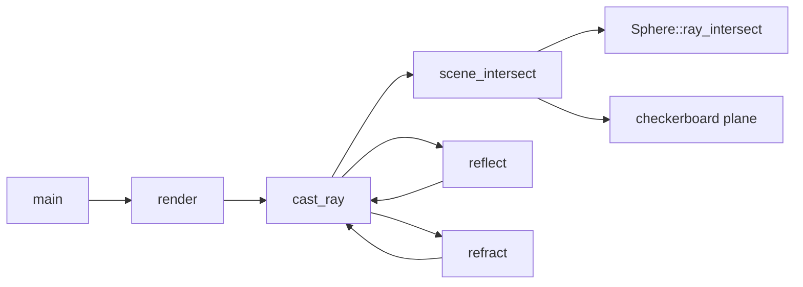

![[res/render.png]]

**1024×768. Four spheres, three point lights, a checkerboard plane.** Diffuse and Phong specular shading, hard shadows, recursive reflection, and refraction with total internal reflection. ~350 lines of C++20. No dependencies, no graphics API, just a `for` loop and a `.ppm` file.

I used [ssloy's tinyraytracer](https://github.com/ssloy/tinyraytracer) as a curriculum rather than a codebase: read a lesson, take notes on the idea, close the tab, implement from the notes. Nothing here was copy-pasted, and the three places where that shows most:
- **[[#Part 7: Refraction, the one I derived|Refraction derived from vector decomposition]]** instead of transcribing the standard Snell's-law one-liner. Total internal reflection falls out of the derivation for free rather than being a special case I looked up.
- **[[#Part 1: The vector library|A templated N-dimensional vector library]]** built on C++20 concepts and union-based storage specializations. One type covering 2D/3D/4D and both integral and floating-point elements, with `.x`/`.y`/`.z` access _and_ generic `data[i]` indexing.
- **[[#Part 2: Ray–sphere intersection, the geometric way|A geometric ray–sphere intersection]]** (project, measure, back off) instead of solving the quadratic, with an early-out before the first square root.

If you only read one section, read [[#Part 7: Refraction, the one I derived|Part 7]].

---
## Ground rules I set for myself

Copying a tutorial produces a working program and zero understanding. So:

1. **Read the lesson, take notes, close the tab.** Notes captured the concept ("refraction bends the tangential component and rebuilds the normal component from the unit-length constraint"), never the code.
2. **Never copy-paste.** If I couldn't rebuild it from the notes, I didn't understand it yet, and I went back to the notes.
3. **Derive the math myself wherever it was tractable.**
4. **Ship it before polishing it.** Pixels on screen, then correct, then fast.

Rule 3 is where the learning happened. Rule 4 is why there's an honest "what I'd change" section at the end instead of a pretense that I got it right first time.

---
## Architecture



|File|Responsibility|
|---|---|
|`vec.hpp`|Templated N-dimensional vector math, concepts, storage specializations|
|`sphere.hpp`|Sphere primitive + geometric ray intersection|
|`material.hpp`|Refractive index, 4-way albedo weights, diffuse colour, specular exponent|
|`light.hpp`|Point light (position + intensity)|
|`main.cpp`|Camera, shading, recursion, scene, PPM writer|

One design decision worth calling out: `material` carries a **`Vec4f` albedo** where each component weights one lighting term `[diffuse, specular, reflection, refraction]`. The shading equation at the bottom of `cast_ray` is then a single weighted sum, so adding a lighting term means widening a vector rather than rewriting the shader. It also gives a free early-out: if `albedoColor[2] <= 0`, the surface isn't reflective and the recursive call is skipped entirely rather than computed and multiplied by zero.

---
## Part 1: The vector library

I could have written `struct Vec3f { float x, y, z; }` and been rendering an hour sooner. I wanted one type that covers 2D, 3D and 4D, works for `int` and `float`, is `constexpr`-friendly, and still reads as `v.x` rather than `v[0]`.

**The tension:** generic code wants `data[i]` indexing. Readable graphics code wants named components. Writing both by hand for every dimension is exactly the duplication templates exist to remove.

**The resolution:** separate _storage_ from _behavior_.

```cpp
template<Arithmetic T, size_t N>
struct vec_storage { T data[N]; };

template <Arithmetic T>
struct vec_storage<T, 3>
{
    union {
        struct { T x, y, z; };
        T data[3];
    };
    constexpr vec_storage() noexcept : x(T()), y(T()), z(T()) {}
};

template<Arithmetic T, size_t N>
struct vec : vec_storage<T, N> { /* every operator, written once */ };
```

`vec` inherits from a specialised storage base. Dimensions 2, 3 and 4 get named components through a union; every other dimension falls back to a plain array. Arithmetic, `dot`, `normalized`, iterators and comparison are written **once**, generically, and work for every `N`.

The `Arithmetic` concept exists for the error messages:

```cpp
template<typename T>
concept Arithmetic = std::integral<T> || std::floating_point<T>;
```

Instantiate `vec<std::string, 3>` and you get one line naming the unsatisfied constraint, instead of forty lines of substitution failure pointing at a header you didn't write. The variadic constructor is constrained on arity for the same reason, so `Vec3f(1, 2)` fails at the call site:

```cpp
template<typename... Args>
requires(sizeof...(Args) == N)
constexpr explicit vec(Args... args) noexcept;
```

**Something I learned the hard way:** `normalized()` is defined _above_ `length()` in the header and calls it anyway. In non-template code that's a compile error. Here it works because `length(v)` is a **dependent call**, the argument type depends on the template parameters, so lookup is deferred to the point of instantiation and resolved through ADL. It compiles, but it relies on a subtlety a reader shouldn't have to know, so I'd reorder the declarations. Understanding _why_ it compiled taught me more about two-phase lookup than any article had.

---
## Part 2: Ray-sphere intersection, the geometric way

The textbook approach substitutes the ray into the sphere equation and solves a quadratic. I wanted to be able to see the answer, so I built it geometrically:

1. Vector from ray origin to sphere centre: `L = center - origin`.
2. Project onto the ray: `tca = dot(L, normalize(dir))`. The point on the ray closest to the centre.
3. Perpendicular distance squared from centre to ray: `d² = dot(L,L) - tca²`. Pythagoras.
4. If `d² > r²`, the ray misses. **This early-out happens before the first `sqrt`**, the expensive operation only runs on rays that actually hit.
5. Otherwise the chord half-length is `thc = sqrt(r² - d²)` and the hits are `tca ± thc`.
6. Take the near hit; if it's behind the camera take the far one; if that's also behind, the sphere is behind us.

Step 6 is quietly load-bearing. When a refracted ray is travelling _inside_ a sphere, the near intersection is negative and the far one is the exit point. Handling that here is what lets light get back out of the glass in Part 7, a bug I only understood after the glass sphere rendered as a black blob.

**An invariant I should have made explicit:** this code computes `tca` from a normalised direction, then reconstructs points using the raw `rayDirection`. Every caller passes a unit vector, so it's correct but that's an unwritten contract enforced by nothing. A distinct `UnitVec3f` type would make the requirement a compile-time guarantee instead of a convention. That's the fix I'd make, and it's a design point rather than a typo: the type system was available to prevent this class of bug and I didn't use it.

---
## Part 3: The camera

Each pixel gets a ray from the origin through a virtual image plane at `z = -1`. Map pixel index into `[-tan(fov/2), +tan(fov/2)]`, scale x by aspect ratio, fire.

My first render came out **vertically mirrored**(floor in the sky). The cause is a convention mismatch everyone meets exactly once: image space has **+y down** (row 0 is the top scanline), world space has **+y up**. Nothing in the code declares either, so nothing warns you.

Current fix, at the call site:

```cpp
frameBuffer[i + j * width] = cast_ray(rayOrigin,
    normalized(Vec3f(rayDirX, -rayDirY, rayDirZ)), spheres, lights);
```

It works, but the negation is in the wrong place. It belongs inside the `rayDirY` formula, where the convention flip actually happens, so the intent is legible instead of looking like a stray minus sign. Correct behaviour, unclear code. The kind of thing I'd expect a reviewer to raise, so I'm raising it myself.

**On my own macro:**

```cpp
#define FOV M_PI * 0.5f
```

Used as `tan(FOV * 0.5f)`, this expands to `tan(M_PI * 0.5f * 0.5f)` = `tan(π/4)` = 1. Correct but only because multiplication is associative. Write `1.0f / FOV` anywhere and it silently computes something entirely different, with no diagnostic. `constexpr float FOV` is type-safe, scoped, and immune to expansion order, and there is no reason to prefer the macro. Textbook hazard; I reproduced it faithfully.

---
## Part 4: Lighting

Diffuse is Lambert: brightness proportional to `max(0, dot(normal, light_dir))`. Specular is Phong: reflect the light direction about the normal, dot with the view direction, raise to the material's specular exponent.

The final colour is the weighted sum from Part 1:

```
diffuse·albedo[0] + white·specular·albedo[1] + reflected·albedo[2] + refracted·albedo[3]
```

The `mirror` material has albedo `(0.0, 10.0, 0.8, 0.0)`, a specular weight of **10**, well above 1. That's deliberate, not an overflow. It's how you get a hot pinpoint highlight on chrome: the specular lobe is extremely narrow (exponent 1425), so the overbright value survives in only a handful of pixels, and the tone-mapping step in Part 9 clamps everything else back into range.

---
## Part 5: Shadows, and shadow acne

A shadow ray runs from the hit point toward each light; if it hits geometry closer than the light, that light contributes nothing.

The first attempt produced **shadow acne**, dark speckles crawling over every lit surface. The cause is floating point: the shadow ray starts exactly on the surface, and rounding lets it immediately re-intersect the surface it came from. Every pixel plays a coin toss with itself.

The fix is to nudge the origin off the surface along the normal, **in the correct direction**:

```cpp
Vec3f shadowOrigin = dot(lightDir, normal) < 0
    ? hitPoint - normal * 1e-3f
    : hitPoint + normal * 1e-3f;
```

If the ray leaves along the normal, offset along the normal; if it leaves into the surface (which happens constantly once refraction exists) offset the other way. I use the same conditional-offset pattern for reflected and refracted ray origins. Get the sign wrong on the refraction path and the ray spawns outside the glass, and the sphere renders opaque.

`1e-3` is a magic number and it's scale-dependent: it works because my scene is roughly unit-sized. A renderer that has to handle both a teacup and a terrain scales epsilon with distance from the camera. Known limitation, deliberately deferred.

---
## Part 6: Reflection

The easy recursion:

```
R = I - 2·dot(I, N)·N
```

Recurse with the reflected ray, multiply by `albedo[2]`, add it in. Depth is capped at 4. Two mirrors facing each other would otherwise recurse until the stack runs out. At the cap the ray returns the background color, which is why deep reflections fade toward sky blue rather than black.

---
## Part 7: Refraction, the one I derived

This is the part I'm most pleased with, and the derivation is still in the comments in `main.cpp`.

The standard implementation is a dense one-liner built around `k = 1 - η²(1 - cos²θ)`. I could have typed it in ten seconds and never understood it. Building it from Snell's law and vector decomposition turned out to be both easier to reason about and shorter to justify.

**Setup.** Snell's law:

$$n_1 \sin\theta_1 = n_2 \sin\theta_2 \implies \sin\theta_2 = \frac{n_1}{n_2}\sin\theta_1 = \eta \sin\theta_1$$

**The key insight.** Split the incident unit vector into a component along the normal and a component in the surface tangent plane:

$$\vec{I} = \vec{I}_N + \vec{I}_T, \qquad \vec{I}_N = (\vec I \cdot \vec N)\vec N, \qquad \vec{I}_T = \vec I - \vec I_N$$

For a **unit** vector, the length of the tangential component _is_ $\sin\theta$. So Snell's law isn't really a statement about angles, it's the statement that **refraction scales the tangential component by η and leaves its direction untouched**:

$$\vec{O}_T = \eta , \vec{I}_T$$

**Rebuilding the normal component.** The output is also a unit vector, so Pythagoras hands it over for free:

$$|\vec{O}_N|^2 + |\vec{O}_T|^2 = 1 \implies \vec{O}_N = -\sqrt{1 - |\vec{O}_T|^2};\vec{N}$$

The minus sign is because the transmitted ray continues _through_ the surface, against the outward normal. Add the components and you have the refracted direction, with no trigonometric functions anywhere in the final code.

**Total internal reflection falls out of the derivation.** If $|\vec{O}_T|^2 > 1$, that square root would be imaginary, which physically means there is no transmitted ray and everything reflects:

```cpp
if (outVectorTangentLengthSq > 1.0f)
    return getReflectRay(normalizedInVector, normalizedNormal);
```

TIR isn't a special case I had to go and look up. It's the geometry telling me the equation has no real solution, and the branch writes itself.

**Rays leaving the object.** A ray inside glass exiting into air is the same maths with η inverted and the normal flipped. The sign of `dot(I, N)` detects it: positive means the ray and the outward normal point the same way, so we're on the way out.

```cpp
if (dot(normalizedInVector, normalizedNormal) > 0.0f) {
    std::swap(sourceRefractiveIndex, destinationRefractiveIndex);
    normalizedNormal = -normalizedNormal;
}
```

The dark band around the rim of the glass sphere in the render is TIR firing at grazing angles, the same effect that makes the edge of a glass marble go opaque. Watching it appear on the first correct run, from math I'd derived rather than copied, was the best moment of the project.

---
## Part 8: The checkerboard floor

An infinite plane at `y = -4`, intersected analytically (`d = -(origin.y + 4) / dir.y`), guarded against near-zero `dir.y` so a ray parallel to the floor doesn't divide by nothing. The pattern comes from the parity of the summed integer coordinates:

```cpp
(int(0.5f * hit.x + 1000) + int(0.5f * hit.z)) & 1 ? gray : brown;
```

The `+ 1000` is a hack with a real justification: `int()` truncates toward zero, so without it the pattern mirrors across `x = 0` and leaves a visible seam. Pushing the operand positive first makes truncation behave like a floor.

**A latent bug I found while writing this up.** When the plane is hit, I only overwrite `outMaterial.diffuseColor`. If a sphere was also hit _further along the same ray_, that sphere's material has already been written to `outMaterial`, so the floor inherits its albedo weights, specular exponent and refractive index. A floor pixel with the glass sphere behind it is shaded using glass's reflection and refraction weights.

The fix is one line: assign a complete floor `material` instead of patching a single field. The more useful takeaway is about the shape of the interface, not the pixel: **an out-parameter that can be partially written is a bug waiting for the right camera angle.** Returning a `std::optional<HitRecord>` makes the invalid state unrepresentable, so the compiler enforces what I was relying on myself to remember.

---
## Part 9: Getting pixels out

PPM (`P6`) is about the simplest image format that exists: ASCII header, then raw RGB bytes. No library, which fit the no-dependencies goal.

Lighting values routinely exceed 1.0. Three lights plus a specular weight of 10 will do that. Clamping each channel independently **shifts the hue**: an over-bright orange clamps toward yellow. So before clamping I normalize by the largest channel, which preserves the ratios between components and therefore the color:

```cpp
float max = std::max(c[0], std::max(c[1], c[2]));
if (max > 1.0f) c = c * (1.0f / max);
```

It's the crudest tone-mapping operator there is, but it's the difference between "bright" and "wrong color".

Two portability details that are easy to skip and painful to debug: the file is opened with `std::ios::binary`, because otherwise Windows translates `0x0A` into `\r\n` and corrupts every pixel whose value happens to be 10; and `_USE_MATH_DEFINES` is defined before `<cmath>` because MSVC doesn't expose `M_PI` otherwise.

---

## Bugs, and how I found them

|Symptom|Cause|Fix|
|---|---|---|
|Image vertically mirrored|Image-space +y is down, world-space +y is up|Negate y when building the ray direction|
|Dark speckles across every lit surface|Shadow ray re-hitting its own surface (FP precision)|Offset ray origin along the normal, sign chosen by `dot(dir, normal)`|
|Glass sphere rendered opaque|Refracted ray origin offset to the wrong side of the surface|Same conditional-offset pattern as shadow rays|
|Objects behind glass shaded wrong|Intersection returned only the near hit, so exit points were missed|Fall back to the far intersection when the near one is negative|
|Floor inherits sphere materials|Partial write to an out-parameter in `scene_intersect`|Assign a complete floor material; better, return `std::optional<HitRecord>`|

The method throughout was blunt and effective: **render the quantity, don't print it.** Suspect the normals? Write `(N + 1) * 0.5` into the framebuffer and look at the colors, a correct normal map has a recognizable shape, and a wrong one is obvious at a glance. Suspect an intersection distance? Render depth as greyscale. A 1024×768 debug image tells you more in one second than a breakpoint hit 786,432 times.

---
## What I'd do next

Ordered the way I'd actually pick them up:

1. **Return `std::optional<HitRecord>`** from `scene_intersect`, which fixes the floor material bug and removes the whole class of partial-write errors.
2. **Fix `normalized()`.** It currently calls `length(v)` _inside_ the loop, so normalizing a `Vec3f` does three square roots where one would do. It's the hottest function in the renderer, and it's a one-line fix. I didn't catch it because it's correct, just wasteful, and correctness was what I was profiling for.
3. **Parallelize the render loop.** The outer loop over scanlines is embarrassingly parallel; `std::for_each(std::execution::par_unseq, ...)` should scale close to linearly with core count.
4. **Replace the `FOV` macro** with a `constexpr float`.
5. **Introduce a `Hittable` interface** so planes and triangles stop being special-cased inside `scene_intersect`.
6. **Fresnel.** Reflection and refraction are currently mixed by fixed weights, but real glass reflects more at grazing angles. Schlick's approximation is a few lines and would visibly improve the glass sphere.
7. **Anti-aliasing** via multiple jittered samples per pixel. The sphere silhouettes are noticeably stair-stepped at one sample.
8. **Distance-scaled shadow epsilon** in place of the fixed `1e-3`.

**Render time**, 1024×768, single-threaded, `-O2`: **105ms**, ~7.5M rays/s primary.
**Method:** min of 15 runs after two discarded warm-ups, timing the render loop only (the PPM write is excluded). Median 109.4ms, stdev ±4.9%. Measured on GCC 13.3, single-vCPU Linux container (not a fast machine), and the noise band is wide enough that anything under a 5% change is unmeasurable here. `render()` times itself and prints throughput, so this is reproducible rather than remembered.

---
## What I took away

**Concepts pay for themselves in error messages, not in generated code.** A constraint violation reported at the call site instead of 200 lines into instantiation is the difference between a two-minute fix and a twenty-minute one. That's the entire return on the `Arithmetic` concept, and it's plenty.

**Deriving beats transcribing.** I can re-derive the refraction vector on a whiteboard, because I know it reduces to "scale the tangential component, rebuild the normal component from the unit-length constraint." Had I typed the one-liner, I'd have a working renderer and no ability to explain it or debug it when it broke.

**Most graphics bugs are convention bugs.** Upside-down image, inside-out normals, shadow acne, refracted rays spawning on the wrong side of a surface, none of those are maths errors. They're disagreements about which way is up or which side is out. The maths is usually right long before the coordinate systems agree.

**When the type system can enforce an invariant, let it.** Both of the most interesting bugs here (the unit-direction contract and the partially-written material) were cases where I relied on discipline instead of the compiler, and the compiler was available.

---
## Build

```bash
g++ -std=c++20 -O2 main.cpp -o raytracer
./raytracer          # writes out.ppm
magick out.ppm out.png
```

No dependencies beyond the standard library.

---
_Reference material: [ssloy/tinyraytracer](https://github.com/ssloy/tinyraytracer), used as a set of lessons rather than a codebase. Every line here was written from notes._