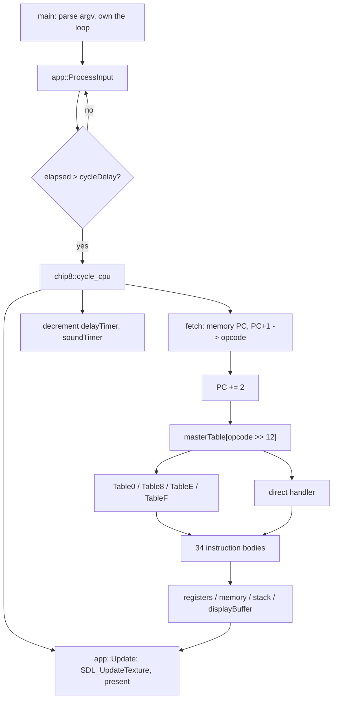

![[res/chip8.gif]]

**4096 bytes of address space, 16 registers, 34 instructions, and a 64×32 monochrome screen.** A fetch-decode-execute loop dispatching through five function-pointer tables, an SDL3 layer that uploads the whole framebuffer as one streaming texture, and a 494-byte Tetris ROM that plays. C++17, one class for the machine and one for the window, no dependency on anything but SDL3 for the presentation layer.

CHIP-8 is not a CPU. It never had silicon. It's an interpreted bytecode from 1977 that ran on a COSMAC VIP, which means writing an emulator for it is writing an emulator for *a specification*, with no hardware to appeal to when the spec is ambiguous. That turns out to be the interesting part.

I used [Austin Morlan's CHIP-8 article](https://austinmorlan.com/posts/chip8_emulator/) the way I've used every reference in this series: read it, take notes on the idea, close the tab, write the code from the notes. The architecture decisions, the SDL3 layer, the timing loop and all 34 instruction bodies are mine, and so are the bugs.

Three findings from this one, and they are all about the same thing, which is that **a program that passes its tests and plays its game can still be wrong, and the only way to know is to measure something other than the output.**

- **[[#Part 4 What the test ROM does not test|The emulator scores 18/18 on an opcode test ROM and plays Tetris, and one of its 34 instructions is flatly wrong.]]** I found it by instrumenting which handlers ever execute. Across both ROMs, **6 of the 34 never run once**, and the broken one is in that set.
- **[[#Part 4 What the test ROM does not test|A two-instruction ROM turns that wrong instruction into a segmentation fault]]**, by way of two more latent bugs downstream of it. The program counter lands inside the built-in font, the font decodes as a valid opcode, and that opcode indexes a 102-entry table with a byte.
- **[[#Part 3 The mask that was in the wrong coordinate space|The one bug the git history actually records was invisible for two days]]**, because the instruction it broke has no observable effect until there is a display. Once there was one, I could put a number on it: the same test ROM goes from 18 OK / 0 NO to **16 OK / 2 NO**.

If you only read one section, read [[#Part 4 What the test ROM does not test|Part 4]].

---
## Why an emulator, after three renderers

The [[Building a CPU Raytracer from Scratch in C++20|raytracer]] taught me to derive maths instead of transcribing it. The [[Rendering an Explosion with One Function|ray marcher]] taught me to read code I didn't write. The [[Raycasting a Maze in Real Time|raycaster]] taught me that shipping a *program* rather than an image changes every decision, because a renderer that runs once can be wrong in ways only one camera angle reveals.

All three had the same escape hatch: **I could look at the output and tell whether it was right.** A fisheye bulge is visible. Inside-out normals are visible. Shadow acne is visible.

An emulator has no such property. The output of a correct `8xy5` and the output of a subtly incorrect `8xy5` are both "Tetris looks fine." Correctness lives in a specification written for hardware I've never touched, and it is enforced, if at all, by ROMs someone else wrote in the 1970s. That was the whole reason to build one:

> **The deliverable is a machine whose correctness I cannot see.**

Everything below follows from that constraint. It is why the debugging method inverted, why I ended up writing a coverage instrument, and why the most interesting bug in the project is one that nothing I ran ever triggered.

The rule about note-taking carried over unchanged. Read the lesson, take notes on the idea, close the tab, rebuild from the notes. Twenty-one commits over four days.

---
## Architecture



| File | Responsibility |
|---|---|
| `chip8.h` / `chip8.cpp` | The whole machine: registers, 4 KB memory, stack, timers, keypad, framebuffer, five dispatch tables, 34 instruction bodies, ROM loading |
| `app.h` | SDL3 window, renderer, streaming texture, event pump, hex-keypad mapping |
| `app.cpp` | One line: `#include "app.h"`. The app layer is header-only; the `.cpp` exists so the build script has something to hand the compiler |
| `main.cpp` | `argv` parsing, the timed loop, and the only place the two halves meet |

The address space it models:

| Range              | Contents                                                     |
| ------------------ | ------------------------------------------------------------ |
| `0x000` to `0x04F` | Unused (on real hardware, the interpreter itself lived here) |
| `0x050` to `0x09F` | The 80-byte hexadecimal font, 16 characters × 5 bytes        |
| `0x0A0` to `0x1FF` | Unused                                                       |
| `0x200` to `0xFFF` | The ROM, 3584 bytes of it                                    |

`chip8` has no dependency on SDL and `app` has no dependency on `chip8`; `main.cpp` is the only translation unit that includes both. That's the boundary that mattered, and it paid for itself immediately: every measurement in this devlog was taken by linking `chip8.cpp` against a twelve-line headless harness that runs N cycles and dumps `displayBuffer` as ASCII. No window, no event loop, no SDL at all.

It paid for itself because the state is **public**. `registers`, `memory`, `displayBuffer` and `keypad` are all public members, and `main.cpp` reaches straight into them. That is not a design I'd defend in a larger system, and I'll come back to it, but it is what made the machine testable from outside without inventing an interface first.

---
## Part 1: Decoding by table

A CHIP-8 opcode is 16 bits, and the top nibble tells you almost everything:

```cpp
opcode = memory[programCounter] << 8u | memory[programCounter + 1];
programCounter += 2;
(this->*masterTable[opcode >> 12u])();
```

Sixteen possible top nibbles, sixteen table slots, one indirect call. Eleven of those slots point straight at an instruction. The other five (`0x0`, `0x8`, `0xE`, `0xF`) point at a *second* table keyed by the low nibble or the low byte:

```cpp
void chip8::Table8() { (this->*table8[opcode & 0x000Fu])(); }
void chip8::TableF() { (this->*tableF[opcode & 0x00FFu])(); }
```

The obvious alternative is a `switch` on the whole opcode, or nested switches. I went with tables for one reason that is worth stating precisely: **a switch encodes the decode strategy in control flow, and a table encodes it in data.** With tables, "which bits select the handler" is one expression per level, written once, and adding an instruction is an assignment in the constructor rather than a new case arm in a function that is already 200 lines long. It also happens to be exactly the shape a real instruction decoder has, which is a nice property for a project whose point is understanding how a decoder works.

The cost is that a table has a *size*, and a size is a claim about the range of the index. That claim is wrong in three of the five tables here, and [[#Part 5 Every array here has a bound nobody wrote down|Part 5]] is about what it costs.

**The one thing that did not compile.** Filling the tables is where C++ makes you say what you mean:

```cpp
table0[table08EsubTableIndex] = OP_NULL;          // error
table0[table08EsubTableIndex] = &chip8::OP_NULL;  // fixed in commit c3be6cd
```

A pointer-to-member function is not a function pointer, and the name of a member function is not implicitly convertible to one. You have to spell out `&chip8::` because the thing being stored isn't an address in the ordinary sense: it's an offset plus a calling convention, resolved against a `this` that doesn't exist yet. Hence the calling syntax, which is genuinely ugly and genuinely honest:

```cpp
(this->*masterTable[opcode >> 12u])();
```

The `this->*` is not ceremony. It is the object being supplied at the call, because it could not be supplied at the store.

**The other type error in the same commit** was subtler and had nothing to do with tables:

```cpp
std::uniform_int_distribution<uint8_t> randomByte;   // undefined behaviour
std::uniform_int_distribution<unsigned int> randomByte;  // the fix
```

The standard permits `uniform_int_distribution` to be instantiated on `short`, `int`, `long`, `long long` and their unsigned versions, and **nothing else**. `uint8_t` is a typedef for `unsigned char`, which is not on that list. Every major implementation compiles it and most of them work, which is exactly what makes it dangerous: it is undefined behaviour that manifests as a portability bug on whichever platform you didn't test. Widening to `unsigned int` and masking with the opcode's low byte costs nothing and is actually defined.

---
## Part 2: Testing the decoder before writing the semantics

Commit `7fde1ee` is called "Added placeholder functionality" and it makes all 34 handlers do this:

```cpp
void chip8::OP_8xy4() { std::cout << std::hex << opcode << ": OP_8xy4\n"; }
```

Two commits later, `c3be6cd` wires up the fetch, adds a `main.cpp` that runs 100 cycles against a ROM, and nothing else. **The machine could not add two numbers, and the decoder was fully tested.**

This is the part of the process I'd defend hardest, and it's a straight lift of how the hardware itself is organised. Decode and execute are separate stages, so they should be separately wrong. With every handler a no-op, the program counter marches linearly from `0x200` and each cycle prints the opcode it fetched next to the handler it dispatched to. Two failure modes (*dispatched to the wrong handler* and *the handler computes the wrong thing*) are cleanly separated, and the first one is checkable by eye against the opcode printed beside it.

There is a detail here I only noticed reconstructing the history: **the ROM used for that decoder test was Tetris.** The file committed as `test.ch8` in `c3be6cd` is byte-identical to the `tetris.ch8` added six commits later; a real game was serving as an opcode-stream generator before a single instruction existed. That is a better fixture than a hand-written one, for two reasons. A real ROM has a realistic opcode distribution, so the common paths get hammered and the rare ones show up as gaps. And because every handler is a no-op, the PC walks straight through the ROM's *data* as well as its code, decoding tables and sprite bytes as if they were instructions, which is precisely the input distribution you want when the thing under test is a decoder and not a program.

It also, three days later, turned out to be the exact input distribution that hides [[#Part 4 What the test ROM does not test|Part 4]].

**Print the quantity, don't render it.** For three projects the debugging method was the opposite: write the value you suspect into the framebuffer and look at it, because a 640×480 debug image tells you more in one second than a breakpoint hit 307,200 times. That method needs the quantity to have a picture. A dispatch decision doesn't. So the trace printer *is* the debug image here, and the thing that makes it work is the same thing that made the normal-map trick work: **one line per event, scanned at a glance, rather than one breakpoint per event, inspected in a debugger.**

---
## Part 3: The mask that was in the wrong coordinate space

This is the one bug in the git history, and its commit message is `Added Display instruction and fixed bug for reading and writing [I]`. Here is the entire fix:

```diff
 void chip8::OP_Fx55()
 {
-    uint8_t Vx = (opcode >> 8u)& 0x0F00u;
+    uint8_t Vx = (opcode >> 8u)& 0x000Fu;
```

`FX55` writes registers `V0` through `Vx` into memory starting at `I`; `FX65` reads them back. Both need `x`, the second nibble of the opcode. There are two correct ways to extract it and this file contains both:

```cpp
uint8_t Vx = (opcode >> 8u) & 0x000Fu;   // shift down, then mask the nibble
uint8_t Vx = (opcode & 0x0F00u) >> 8u;   // mask in place, then shift down
```

Twenty-seven of the twenty-eight sites that extract `x` use the first. `OP_Fx33` is the single one that uses the second. They are equivalent, and the bug is neither of them. The bug is the **hybrid**: shift down like the first, then apply the mask belonging to the second. `0xF155 >> 8` is `0xF1`; `0xF1 & 0x0F00` is `0`. The mask was written for the bit positions the value had *before* it was shifted.

**So `Vx` was always 0**, and both instructions silently degraded into "save and restore `V0`, and nothing else." Not a crash. Not a wrong address. Just fifteen registers quietly not participating.

That is the exact shape of the assert bug from my [[Raycasting a Maze in Real Time#Part 7 Two texture bugs that cancelled each other|raycaster]], where a bounds check validated a global coordinate against a local array. Same category, different domain: **a mask is a statement about which coordinate space its operand is in, and nothing in the type system records that.** `uint16_t` is `uint16_t` whether the nibble you want is at bit 8 or bit 0. The compiler cannot help, and it did not warn, because there is nothing wrong with the expression, it computes zero correctly.

**Why it survived two days.** Look at the commit it was fixed in. `FX55`/`FX65` are pure state movement between registers and RAM; on their own they produce no output at all. The decoder test in [[#Part 2 Testing the decoder before writing the semantics|Part 2]] couldn't catch it because the decoder was fine. It became observable in exactly the commit that added `OP_Dxyn`, because that is the commit where the machine gained the ability to *show* the contents of a register. **The bug was fixed the same hour the emulator grew a screen, and that is not a coincidence (it is the definition of observability).**

**Putting a number on it.** Reverting just those two masks and re-running the opcode test ROM through a headless harness:

| Build | Cells passing | Cells failing |
|---|---|---|
| As shipped | **18 OK** | 0 NO |
| With the pre-fix mask on `FX55` only | 17 OK | 1 NO (row 4) |
| With the pre-fix mask on both | 16 OK | **2 NO** (rows 4 and 5) |

The ROM draws a grid of labelled cells, each reading `OK` or `NO`, and I scanned the framebuffer for the two 8×4 glyph pairs directly rather than squinting at ASCII art. Breaking `FX55` alone flips exactly one cell; breaking `FX65` alone flips exactly the other. Two lines, two cells, causally pinned.

Which raises the obvious question, and it is the whole next section: **the test ROM catches this one. What doesn't it catch?**

---
## Part 4: What the test ROM does not test

The emulator scores **18 out of 18** on the opcode test ROM and plays Tetris for as long as I care to keep playing. Both of those facts are true and neither of them is evidence of very much, because there is a quantity underneath them that nobody measures: **which handlers ever execute.**

So I measured it. Same headless harness, plus a counter keyed on the decoded opcode class, run over both ROMs.

| ROM | Cycles | Distinct handlers exercised |
|---|---|---|
| `test.ch8` (opcode test) | 5,000 | 22 of 34 |
| `tetris.ch8` | 200,000 | 17 of 34 |
| **Union of both** | | **28 of 34** |

**Six of the thirty-four instruction bodies in this emulator have never executed once.** Not "rarely". Not "only in edge cases". Zero times, across a purpose-built conformance ROM and two hundred thousand cycles of real gameplay:

| Never executed | What it does                            |
| -------------- | --------------------------------------- |
| `00E0`         | CLS = clear the display                 |
| `8xy7`         | SUBN = reverse subtract                 |
| `Fx0A`         | LD Vx, K = block until a key is pressed |
| `Fx18`         | LD ST, Vx = set the sound timer         |
| `Fx29`         | LD F, Vx = point I at a font character  |
| **`Bnnn`**     | **JP V0, addr = jump to `nnn + V0`**    |

That last one is wrong.

```cpp
void chip8::OP_Bnnn()
{
    programCounter = memory[opcode & 0x0FFFu] + registers[0];
}
```

The instruction is "jump to address `nnn` plus the contents of `V0`." What this does is **read the byte stored at address `nnn` and jump to that**. It dereferences the operand instead of using it. `A` and `B` are adjacent nibbles, `Annn` legitimately loads an address into `I`, and this is what happens when you write the two of them in the same sitting.

The consequence is deterministic and, once you see it, faintly funny. `memory[]` holds `uint8_t` and `registers[0]` holds `uint8_t`, so the sum is at most **510**. The ROM is loaded at **512**. **The buggy instruction is arithmetically incapable of jumping anywhere in the program, ever.** It always lands in the interpreter-reserved region below `0x200`, which on this machine contains 80 bytes of font and 4016 bytes of zero.

I wrote a two-instruction ROM to watch it happen:

```
0x200:  6000     LD V0, 0
0x202:  B300     JP V0, 0x300        ; spec: PC = 0x300. this build: PC = memory[0x300] + V0
0x300:  50       ; one byte, placed so the buggy jump has somewhere to go
```

```
pc=200 op=6000
pc=202 op=B300
pc=050 op=F090        <- the program counter is now inside the font
Segmentation fault
```

The jump lands at `0x050`, which is the first byte of the character `0` in the font table. The font's first two bytes are `F0 90`, and `F090` is a perfectly well-formed opcode: top nibble `F`, so dispatch through `TableF`, which indexes on the **low byte**:

```cpp
chip8func tableF[0x65 + 1];                      // 102 entries
(this->*tableF[opcode & 0x00FFu])();             // index range 0 .. 255
```

`0x90` is 144. The table has 102 entries. The read is out of bounds, the value fetched is whatever the object happens to contain past the end of `tableF`, and it is then called as a pointer-to-member function. That is the segfault, in a plain optimised build with no sanitizer involved.

**Three latent bugs, chained, reachable from four bytes of ROM.** A wrong operand puts the PC in the font; the font is valid-looking code; the code indexes a table with a value the table was never sized for. Any one of them alone is a shrug. Together they are a crash that nothing in my test suite, nothing in the game, and nothing in the opcode test ROM will ever produce.

**What I actually take from this.** I did not find this by testing harder. The test ROM is a good test ROM and it is *green*. I found it because I stopped asking "does it pass" and asked "what did it run", and those are different questions with different instruments. Coverage is not a testing nicety here; it is the only thing standing between "18/18" and "18/18, on 82% of the code."

And the six never-executed handlers are not a random sample. Look at what they are: clear-screen, reverse-subtract, block-on-key, the sound timer, the font pointer. They are the instructions that a small ROM has no reason to use. **Untested code concentrates in the corners of a specification, and a conformance suite written against typical programs will systematically miss the atypical ones.** That is a general property of test corpora, not a fact about CHIP-8, and it is the reason "we have tests" and "we have coverage" are not interchangeable claims in any codebase I will ever work in.

---
## Part 5: Every array here has a bound nobody wrote down

Once `tableF` turned out to be indexable past its end, the obvious move was to check the rest. Every array in `chip8` is a fixed-size member, every index is derived from ROM data, and in four cases out of five the two do not agree.

| Array                        | Declared size          | Index expression              | Reachable range | Agrees?        |
| ---------------------------- | ---------------------- | ----------------------------- | --------------- | -------------- |
| `masterTable`                | `[0xF + 1]` = 16       | `opcode >> 12`                | 0 to 15         | yes            |
| `table0`, `table8`, `tableE` | `[0xE + 1]` = **15**   | `opcode & 0x000F`             | 0 to **15**     | **off by one** |
| `tableF`                     | `[0x65 + 1]` = **102** | `opcode & 0x00FF`             | 0 to **255**    | **off by 154** |
| `memory`                     | 4096                   | `index + i`, `programCounter` | 0 to 4110       | **no**         |
| `displayBuffer`              | 2048                   | `(yPos+row)*64 + xPos+col`    | 0 to **2950**   | **no**         |

Only `masterTable` is right, and it is right for a structural reason: a 4-bit index has exactly 16 values and the table has exactly 16 slots, so the size *is* the range. Every other table is sized to **the largest opcode that happens to be valid** rather than to the largest index the expression can produce. `table8` stops at `0xE` because `8xyE` is the last legal `8` instruction; but `8xyF` is a perfectly reachable 16-bit value, and nothing between the ROM and the array subscript rejects it.

**The display buffer is the one that should worry you most**, because it is written, not read. `Dxyn` wraps the sprite's origin and then adds to it:

```cpp
uint8_t xPos = registers[Vx] % 64;
uint8_t yPos = registers[Vy] % 32;
...
uint32_t *screenPixel = &displayBuffer[(yPos + row) * 64 + (xPos + col)];
```

The modulo wraps the *starting* coordinate. Nothing wraps or clips `xPos + col` or `yPos + row`. A 15-row sprite starting at (63, 31) computes a maximum index of **2950** into a 2048-element array. That is **3608 bytes past the end of the buffer.**

Here is what lives there:

```
sizeof(chip8)  = 14992 bytes
displayBuffer  = bytes  4168 .. 12360
opcode         = byte  12360
RNG state      = bytes 12368 .. 12384
dispatch tables= bytes 12384 .. 14992   <- 2608 bytes of pointer-to-member function
```

(g++ on x86-64; the exact offsets are ABI-dependent, the ordering is not.)

**A sprite drawn near the bottom-right corner XORs `0xFFFFFFFF` over the emulator's own dispatch tables**, and then keeps going past the end of the object entirely. The machine's instruction decoder is downstream of its framebuffer in memory, and the framebuffer has no upper bound.

I want to be precise about how bad this actually is, because "reachable" and "reached" are different words. I instrumented the write itself (not the computed index, the actual XOR) and ran both ROMs:

| ROM | Cycles | Sprite writes past the buffer |
|---|---|---|
| `test.ch8` | 5,000 | 0 |
| `tetris.ch8` | 200,000 | 0 |
| my five-instruction sprite ROM | 4 | **34, immediately** |

Tetris comes close. It draws a 4-row sprite at (30, 29), whose bottom row computes indices 2078 to 2085 (past the end) but the sprite's bottom row happens to be blank in those columns, and the write only happens `if (spritePixel)`. **The bound is violated by the address computation on every frame and saved by the contents of the sprite.** That is not a safety property. That is luck with good timing.

**The fix is not a bounds check, it is a decision.** There are two defensible behaviours for a sprite that runs off the edge  (clip it, or wrap it to the opposite edge) and real CHIP-8 programs depend on which one you pick. The current code implements a third thing, which is "index into whatever is next in the struct," and it implements it *because nobody chose*. A missing bound is usually a missing decision wearing a bounds check's clothes.

The same reasoning applies to `memory`. `Fx55` writes `memory[index + i]` for `i` up to 15, with `index` a 12-bit value that can be `0xFFF`, so a ROM can write 15 bytes past the end of a 4 KB array whose successor in the struct is `index` itself. And `load_rom` reads a file straight into `memory + 0x200` with **no size check at all**, so a 4 KB ROM overruns the address space by 512 bytes into the display buffer and the keypad.

`load_rom` has one more property worth naming:

```cpp
std::ifstream rom(fileName, std::ios::binary | std::ios::ate);
if (rom.is_open()) { /* ... */ }
// no else
```

A path that doesn't exist produces no error, no message, and no non-zero exit. Memory stays zero-filled, `0x0000` decodes to `masterTable[0] → table0[0] → OP_00E0`, and the emulator sits there **clearing an already-blank screen, 333 times a second, forever**, until the PC walks past 4095 and starts fetching out of bounds. A typo in a ROM path produces a black window and total silence. Twelve lines of error handling would turn the most likely user mistake in the entire program into a one-line diagnostic.

---
## Part 6: Three clocks, one knob

The CHIP-8 specification describes three independent rates. The CPU executes instructions at whatever speed the host manages, roughly 500 to 1000 per second on a VIP. The delay and sound timers decrement at **exactly 60 Hz**, independent of the CPU. The display refreshes at whatever the display refreshes at.

Here is `cycle_cpu`:

```cpp
opcode = memory[programCounter] << 8u | memory[programCounter + 1];
programCounter += 2;
(this->*masterTable[opcode >> 12u])();

if (delayTimer > 0) delayTimer--;
if (soundTimer > 0) soundTimer--;
```

And here is the loop that drives it:

```cpp
if (dt > static_cast<float>(cycleDelay))
{
    lastCycleTime = currentTime;
    chip8Core.cycle_cpu();
    mainApp.Update(chip8Core.displayBuffer, videoPitch);
}
```

**The timers decrement once per instruction, and the display presents once per instruction.** All three rates have collapsed onto a single number, `cycleDelay`, passed on the command line. The shipped launch script uses `3`:

$$
\text{CPU} = \frac{1000}{3} \approx 333\ \text{Hz}, \qquad
\text{timers} = 333\ \text{Hz}, \qquad
\text{display} = 333\ \text{Hz}
$$

The timers are supposed to run at 60. They run at **5.6× the specified rate**, and the test script's `1` makes it **16.7×**.

This is not a cosmetic issue, because Tetris uses the delay timer as its clock. In 200,000 cycles it executes `Fx15` (set delay timer) 799 times and `Fx07` (read delay timer) 316 times; the piece fall rate, the input repeat rate and the line-clear animation are all `LD DT, n` followed by a busy-wait on `LD Vx, DT`. On real hardware that wait is `n/60` seconds *regardless of CPU speed*, that is the entire reason the timers are specified as an independent 60 Hz clock. Here the wait is `n` instructions, because each instruction in the wait loop decrements the very timer it is polling.

So the game's speed depends on `cycleDelay` twice, in opposite directions, and the two effects don't cancel (they multiply). Turning the CPU down to make the game slower also turns the timers down, which makes every timed delay complete in the same number of instructions it always did. **The knob labelled "emulation speed" cannot actually change the ratio of anything to anything.**

The fix is small and I want to be clear that it is small, because the interesting part isn't the fix:

```cpp
// timers advance on their own 60 Hz accumulator, in the loop, not in cycle_cpu
timerAccumulator += dt;
while (timerAccumulator >= 1000.0f / 60.0f) {
    if (delayTimer) delayTimer--;
    if (soundTimer) soundTimer--;
    timerAccumulator -= 1000.0f / 60.0f;
}
```

Two accumulators (one for CPU cycles, one for timers) and the display presents when the framebuffer is dirty rather than when an instruction retires. That's maybe fifteen lines.

**What's worth extracting is why the collapse happened at all.** `cycle_cpu` is named for one job and does three, and the two extra ones got in because they are *mentioned in the same paragraph of the spec* as the fetch-decode-execute cycle. Proximity in a document became proximity in a function, and a function that ticks three clocks has silently asserted that they are the same clock. **Every independent rate in a system deserves its own accumulator, and the moment two of them share one, the system has lost the ability to express the difference between them.** That is the same failure shape as the depth buffer in my [[Raycasting a Maze in Real Time#Part 4 What belongs in a depth buffer|raycaster]] (two different quantities stored in one `float`, with nothing recording the difference) except that here the two quantities are *times*, and the loss is invisible because both of them still tick.

---
## Part 7: The display layer, and the bug that monochrome hides

The framebuffer is `uint32_t displayBuffer[64 * 32]`, where every pixel is either `0x00000000` or `0xFFFFFFFF`. That is **8192 bytes to store 2048 bits**, a 32× overhead, on a machine whose entire address space is 4 KB.

It's the right call, and it is worth saying why, because "wasteful" and "wrong" are not synonyms. The buffer is not modelling the CHIP-8 display. It is modelling the **SDL texture**, so `SDL_UpdateTexture` takes a pointer to it and uploads it with no packing, unpacking or conversion step:

```cpp
SDL_UpdateTexture(texture, nullptr, buffer, pitch);
```

It also makes `Dxyn` trivial. A CHIP-8 sprite pixel is one bit and a screen pixel is 32, so they cannot be XORed directly, but a sprite bit that is *set* means "invert this pixel", and inverting a pixel that is all-zeros-or-all-ones is `^= 0xFFFFFFFF`. One instruction, no branch on the current value, collision detection falling out of a comparison against the same constant.

The cost is that the constant `0xFFFFFFFF` now appears in three places (the clear, the collision test, the XOR) and each occurrence independently assumes the encoding. Change the pixel format and the collision test in `Dxyn` doesn't fail to compile, it just quietly stops detecting collisions, which in Tetris means pieces stop landing. An invariant spread across three call sites with no owner is the same problem as the sprite bound in Part 5, one abstraction level up.

**And there's a bug here that cannot fire, which is the interesting part.** The texture is created as:

```cpp
SDL_CreateTexture(renderer, SDL_PIXELFORMAT_RGBA8888, SDL_TEXTUREACCESS_STREAMING, 64, 32);
```

In my [[Raycasting a Maze in Real Time#Part 9 From frames on disk to a window|raycaster]] I spent real time on exactly this line, because SDL names pixel formats by byte order **within a 32-bit word, most significant first**, not by their order in memory. So a little-endian buffer with red in the low byte is `ABGR8888`, and guessing `RGBA8888` swaps red and blue on every pixel. It looks like a rendering bug and it sends you into the wrong file.

Here, `RGBA8888` is what's written, and it is invisible whether it's right or wrong. `0xFFFFFFFF` is identical under every permutation of its bytes, and so is `0x00000000`. **A monochrome framebuffer cannot distinguish a correct pixel format from an incorrect one**, in precisely the way that a 512×512 framebuffer cannot distinguish a correct row stride from an incorrect one, which is the bug that cost me a day on the last project.

That is now twice, in two consecutive projects, that a degenerate value has deleted a whole class of bug from my ability to observe it. I'm treating it as a rule: **when a test fixture makes two things equal, it has stopped testing the difference between them.** Square buffers hide strides. Monochrome hides channel order. Zero-filled memory hides load failures. The fixture that catches the most bugs is the one where every dimension, channel and constant is deliberately distinct.

One more thing about the SDL3 layer, carried over deliberately from last time: none of the initialisation is checked. `SDL_Init`, `SDL_CreateWindow`, `SDL_CreateRenderer` and `SDL_CreateTexture` all return values that this constructor ignores. I knew the SDL3 convention going in (success is `true`, not `0`, inverted from SDL2) and wrote the constructor anyway with no checks, because the emulator was the interesting part and the window was scaffolding. That's a defensible priority and an indefensible constructor: a `chip8` object that fails to get a window still runs, still executes ROMs, and still returns 0 from `main`.

---
## Bugs, and how I found them

| Symptom                                      | Cause                                                                                                            | Fix                                                                                                                                    |
| -------------------------------------------- | ---------------------------------------------------------------------------------------------------------------- | -------------------------------------------------------------------------------------------------------------------------------------- |
| `table0[i] = OP_NULL` refused to compile     | A member function's name is not convertible to a pointer-to-member; the object isn't available at the store      | `&chip8::OP_NULL`, and `(this->*table[i])()` at the call -> [[#Part 1 Decoding by table\|Part 1]]                                      |
| `FX55`/`FX65` moved only `V0`                | `(opcode >> 8u) & 0x0F00u` = shifted like one idiom, masked like the other, so `Vx` was always 0                 | `& 0x000Fu`. Measured: the test ROM goes 18 OK → 16 OK / 2 NO -> [[#Part 3 The mask that was in the wrong coordinate space\|Part 3]]   |
| Nothing. 18/18 and Tetris plays              | `Bnnn` dereferences its operand: `memory[nnn] + V0` instead of `nnn + V0`. Never executed by either ROM          | Found by measuring handler coverage, not by testing -> [[#Part 4 What the test ROM does not test\|Part 4]]                             |
| Segfault from a 4-byte ROM                   | `Bnnn` → PC lands in the font → `F090` decodes → `tableF[0x90]` indexes a 102-entry array                        | Size the tables to the index range, not to the last valid opcode -> [[#Part 5 Every array here has a bound nobody wrote down\|Part 5]] |
| Timers run 5.6× fast at the shipped settings | `cycle_cpu` decrements both timers once per instruction; the loop presents a frame per instruction too           | Separate accumulators for CPU and 60 Hz timers -> [[#Part 6 Three clocks, one knob\|Part 6]]                                           |
| Silent black window                          | `load_rom` has no `else` on `is_open()`; zeroed memory decodes as `00E0` forever                                 | Report the failure and exit non-zero                                                                                                   |
| `if (stackPointer < 0)` never fires          | `stackPointer` is `uint8_t`; `-Wtype-limits` says *comparison is always false due to limited range of data type* | Check `== 0` **before** the decrement, not `< 0` after it                                                                              |
| `memset` compiles on clang, fails on g++     | `<cstring>` is never included; the MSVC headers pull it in transitively and libstdc++ does not                   | Include what you use                                                                                                                   |

The method that found the last four is the one I'd point at. **The trace printer and the headless harness are the same tool at two scales.** `chip8.cpp` has no dependency on SDL, so linking it against a twelve-line `main` that runs N cycles and dumps `displayBuffer` as ASCII costs nothing, runs in milliseconds, and can be re-linked with any single line of the emulator deliberately reverted. That is how the 18-vs-16 measurement in Part 3 was taken, how the coverage table in Part 4 was taken, and how the out-of-bounds write counts in Part 5 were taken. Every number in this devlog is a `g++` invocation away from being reproduced.

The thing that made that possible was a design decision I'd previously have filed under "obviously correct, not interesting": **keeping the machine free of the presentation layer.** It stops being a tidiness argument the moment you want to run the machine ten thousand times without a window.

---
## What I'd do next

Ordered the way I'd actually pick them up.

1. **Size the dispatch tables to their index ranges.** `table0`, `table8` and `tableE` become 16 entries, `tableF` becomes 256, all prefilled with `OP_NULL`. This is four characters of change and it converts the crash in Part 4 into a silent no-op, which is the correct behaviour for an undefined opcode. Everything else on this list is optional; this one is not.
2. **Fix `Bnnn`:** `programCounter = (opcode & 0x0FFFu) + registers[0];`
3. **Decide what `Dxyn` does at the screen edge**, then implement the decision. Clip or wrap, either is defensible; indexing past the framebuffer into the dispatch tables is not.
4. **Give the timers their own 60 Hz accumulator**, take them out of `cycle_cpu`, and present a frame when the framebuffer is dirty rather than when an instruction retires. Then `cycleDelay` becomes a CPU-speed knob that means what its name says.
5. **Error-handle `load_rom`:** report a failed open, and reject a ROM larger than `4096 - 0x200` bytes instead of writing it into the framebuffer.
6. **Replace `OP_Fx0A`'s sixteen-branch `if`/`else if` chain with a four-line loop.** It's the one handler in the file that is long for no reason, and the loop is also more correct: the chain always reports the lowest-numbered key held, which silently makes key 0 win every simultaneous press.
7. **A `Nibble` type, or at minimum one `vx(opcode)` helper.** Thirty-four handlers extract the same two nibbles by hand, in two different idioms, and Part 3 is what happens when someone blends them. One function, used everywhere, and the bug in Part 3 becomes unwritable rather than merely fixed.
8. **A CHIP-8 disassembler**, which is thirty lines given the tables already exist, and would have made Part 4 a five-minute investigation instead of an hour. Being able to print `0x2B4: LD VB, 0x1A` next to a trace line is the emulator equivalent of rendering the normal map.
9. **`SDL_AUDIO` for the sound timer.** `Fx18` is implemented, has never executed, and drives a beeper that does not exist. It is the only instruction whose output device is missing entirely.
10. **The stack, properly.** Sixteen entries, `stack[stackPointer++]` with no check on either end, and a guard against underflow that the compiler can prove is dead.

---
## What I took away

**"It passes" and "it ran" are different measurements, and only one of them is about the code you wrote.** The opcode test ROM is green. Tetris plays. Eighteen out of eighteen. And six of thirty-four instruction bodies had never executed, one of them was wrong, and reaching it crashes the process. Nothing about running the tests harder would have surfaced that, it needed a different instrument pointed at a different quantity. Every project in this series has had a moment where the answer was *stop reasoning and measure*; this is the first one where the thing worth measuring wasn't a number in the output at all.

**A missing bound is usually a missing decision.** `tableF` is 102 entries because 102 is where the valid opcodes stop, and `Dxyn` walks off the framebuffer because nobody chose between clipping and wrapping. In both cases the array size is standing in for a decision that was never made, and the compiler dutifully encoded the non-decision as a number. When I find an off-by-N now, my first question is no longer "what should the bound be" but "what was the bound supposed to be *deciding*".

**Observability is a feature with a ship date.** The `FX55` bug existed for two days and was fixed within an hour of the emulator gaining a display, because for those two days the machine had no way to show the contents of a register. That is not a story about carelessness. It is a story about the fact that *a bug you cannot observe does not exist yet, operationally*, and that the highest-leverage work is often the work that makes other bugs visible rather than the work that fixes them. The trace printer in Part 2 and the headless harness in Part 4 are both that same investment, at different points in the project.

**When a fixture makes two things equal, it stops testing the difference.** A square framebuffer can't tell a right stride from a wrong one. A monochrome framebuffer can't tell `RGBA8888` from `ABGR8888`. Zero-filled memory can't tell a loaded ROM from a missing file. That's three, across two projects, and I now deliberately pick fixtures where every dimension and every constant is distinct, for the same reason you never test a matrix library with the identity.

**The boundary I drew for tidiness turned out to be the test harness.** `chip8` knowing nothing about SDL looked like ordinary hygiene when I wrote it. It is the reason I could link the machine against a twelve-line `main`, run it two hundred thousand cycles in a few milliseconds, revert one line at a time, and put actual numbers in this devlog instead of adjectives. Decoupling is usually sold as a maintenance argument. Its real return, at least here, was *measurement*.

---
## Build

Source: [kads1024/emulator-chip8](https://github.com/kads1024/emulator-chip8)

```bash
clang++ -std=c++17 -fms-compatibility main.cpp app.cpp chip8.cpp \
    -o main.exe -I. -ISDL3 -Llib/x64 lib/x64/SDL3.lib
```

SDL3 headers and prebuilt libraries for x86, x64 and arm64 are vendored in the repo, so the only prerequisite is a C++17 compiler. Copy `lib/x64/SDL3.dll` next to `main.exe`.

```bash
main.exe <scale> <cycle-delay-ms> <rom>

main.exe 10 3 tetris.ch8     # the demo above
main.exe 10 1 test.ch8       # the opcode test ROM
```

The COSMAC VIP's hex keypad is mapped onto the left of a QWERTY keyboard, `Esc` quits:

```
CHIP-8 keypad          Keyboard
1 2 3 C                 1 2 3 4
4 5 6 D      -->        Q W E R
7 8 9 E                 A S D F
A 0 B F                 Z X C V
```

To reproduce any measurement in this devlog, link `chip8.cpp` against a `main` that constructs a `chip8`, calls `load_rom`, loops `cycle_cpu()`, and prints `displayBuffer`. The state is public, so no other scaffolding is required.

---
_Reference material: [Austin Morlan's CHIP-8 emulator article](https://austinmorlan.com/posts/chip8_emulator/), read as a set of lessons rather than a codebase. It is where I learned that opcode dispatch wants to be a table. The architecture, the SDL3 layer, the timing loop, all 34 instruction bodies and every bug above are mine, and the git history is the record of which is which._
