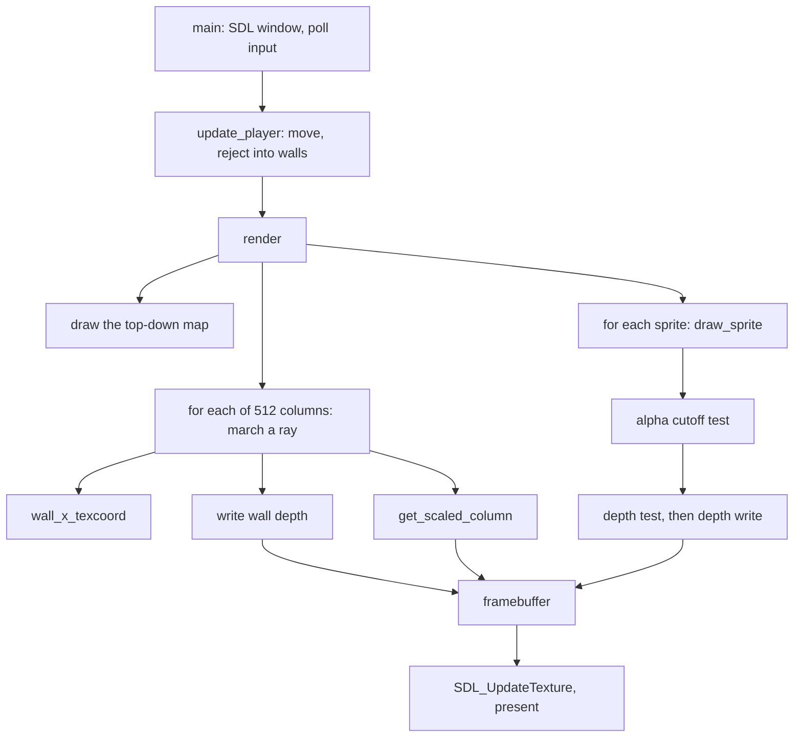

![[res/raycaster.gif]]

**1024x512. A 16x16 grid, 512 rays a frame, six wall textures, four billboard monsters, and one megabyte of depth.** Textured walls with fisheye correction, alpha-cut sprites that occlude against walls and against each other, WASD movement with wall collision, all on the CPU into a flat `uint32_t` array that SDL3 uploads as a single streaming texture. No GPU shaders, no engine.

This is my version of [ssloy's tinyraycaster](https://github.com/ssloy/tinyraycaster), and it is the third project in a row where I read the lessons, took notes, closed the tab, and wrote the code from the notes. That process is only worth anything if it produces disagreements with the original, and this time it produced three worth writing down:

- **[[#Part 4 What belongs in a depth buffer|The original stores one distance in the depth buffer and compares it against a different one.]]** Wall depth is the fisheye-corrected distance; sprite depth is the raw radial distance. Those are not the same quantity, and at the edge of a 60 degree view they differ by about 13%.
- **[[#Part 5 The depth buffer that removed a sort|A per-pixel depth buffer removes the sprite sort entirely.]]** The original sorts every sprite back to front every frame and carries a `player_dist` field and an `operator<` on `Sprite` to do it. Mine carries three fields and no comparison operator.
- **[[#Part 7 Two texture bugs that cancelled each other|Two texture-indexing bugs that cancelled out]]** across a caller and a callee, so the walls looked correct for a full day of work. The instant a second caller used the interface the way it was documented, everything broke at once.

If you only read one section, read [[#Part 4 What belongs in a depth buffer|Part 4]].

---
## The rule this time

My [[Building a CPU Raytracer from Scratch in C++20|raytracer]] taught me to derive math instead of transcribing it. My [[Rendering an Explosion with One Function|ray marcher]] taught me to read code I did not write. Both produced a `.ppm` file and exited.

So the rule for this one was different: **the deliverable is a program, not an image.** A frame loop, real input, and a window. That single constraint pushed on everything. A renderer that runs once can allocate freely, leak freely, and be wrong in ways that only show up from one camera angle. A renderer that runs sixty times a second gets audited by the user's hands.

The note-taking rule carried over unchanged. Read the lesson, take notes on the idea, close the tab, rebuild from the notes. Everything below that reads like a design decision was one, because I had to make it before I had anything to copy.

---
## Architecture



| File | Responsibility |
|---|---|
| `main.cpp` | SDL window and renderer, event loop, input state, movement and collision |
| `renderer.cpp` | Ray marching, wall projection, texture column blit, sprite billboards, depth testing |
| `framebuffer.h/.cpp` | `frameBuffer` (colour, `uint32_t`) and `depthBuffer` (distance, `float`) |
| `texture.cpp` | Loads a horizontally packed texture sheet, samples it, scales a column |
| `map.cpp` | The 16x16 grid, stored as one string literal |
| `utils.cpp` | Colour packing, PPM writer (kept from the pre-SDL days) |
| `player.h` / `sprite.h` | Camera state and billboard state, both plain data |

The window is split down the middle: top-down map on the left, first person view on the right. That is why the depth buffer is 512 wide rather than 1024, and why `screenWidth` appears as an offset in the sprite blit.

---
## Part 1: The whole algorithm, in one paragraph

For each of the 512 columns in the viewport, take the angle that column represents, walk a point along that angle in steps of 0.01 grid units until it lands in a non-empty map cell, and draw a vertical strip whose height is inversely proportional to how far you walked. That is the whole algorithm. No geometry, no triangles, no projection matrix. A wall is a column of pixels of height `screenHeight / distance`, and a corridor is 512 of those side by side.

Everything interesting in this project turned out to be a consequence of that one division, because "how far you walked" is more ambiguous than it looks.

---
## Part 2: The stride bug that a square buffer hid

Until the seventh commit the image was 512x512, and the framebuffer was indexed like this:

```cpp
buffer[currentPixelY * bufferHeight + currentPixelX] = rectColor;
```

That is wrong. The stride between rows is the **width**, not the height. It rendered perfectly anyway, because `bufferWidth == bufferHeight == 512` makes the two expressions literally the same number.

Then I widened the window to 1024x512 to fit the first person view next to the map, and the whole image sheared into a diagonal smear. Two lines were wrong, in two different functions, and both had been wrong since the day they were written.

**The lesson is a testing lesson, not a graphics one.** A square buffer makes width and height interchangeable, which means it cannot distinguish a correct stride from an incorrect one. Any test fixture whose dimensions are equal has silently deleted a whole class of bug from its coverage. I now pick deliberately unequal dimensions for anything indexed two-dimensionally, for the same reason you do not test a matrix library with the identity.

The same commit also replaced an `assert` in `draw_rectangle` with a bounds check that skips out-of-range pixels. Once the wall columns became taller than the screen, clipping stopped being an error condition and became the normal case.

---
## Part 3: Fisheye, and why the correction is a cosine

The naive version uses the ray's travel distance directly:

```cpp
float columnHeight = bufferHeight / rayMarchStepSize;
```

Walk down a straight corridor with that and the walls bulge toward you in the middle of the screen, as if the world were painted on the inside of a barrel.

The cause is that `rayMarchStepSize` is a **radial** distance, measured from the player outward along the ray, and every ray points a different way. A wall directly ahead is closer to the player than the same wall seen at 30 degrees off-axis, because the off-axis ray has to travel diagonally to reach it. So the flat wall gets drawn shorter at the edges and taller in the middle, which is exactly a fisheye.

A screen is a plane, not an arc. What a flat screen needs is the distance measured **along the view axis**, which is the radial distance projected onto the forward direction:

$$d_{\text{screen}} = t \cos(\theta_{\text{ray}} - \theta_{\text{player}})$$

```cpp
float projectedDistance = rayMarchStepSize * std::cos(currentFovAngle - mainPlayer.viewDirectionAngle);
float columnHeight = buffer.height / projectedDistance;
```

One `cos` and the corridor goes flat. Hold on to the fact that there are now **two different distances in scope for the same wall**, because that is the entire next section.

---
## Part 4: What belongs in a depth buffer

A sprite is drawn if it is nearer than the wall behind it. The test is one comparison:

```cpp
if (depth.get_pixel(horizontalOffset + pixelX, verticalOffset + pixelY) < spriteDist)
    continue; // dont draw column behind the current depth
```

The question nobody asks is which of the two wall distances goes into `depth`, and the answer is not "whichever one you already have in a variable."

I store the raw ray distance:

```cpp
depth.set_pixel(fovAngleStep, rayMarchStepPixelY, rayMarchStepSize);
```

The original stores the corrected one:

```cpp
float dist = t*cos(angle-player.a);
depth_buffer[i] = dist;
```

Both then compare that stored value against the sprite's distance, which in both codebases is plain Pythagoras from the player to the sprite:

```cpp
float spriteDist = std::sqrt(std::pow(mainPlayer.x - inSprite.posX, 2) + std::pow(mainPlayer.y - inSprite.posY, 2));
```

That is a **radial** distance. It has no idea which screen column it will land in and no cosine applied to it. So storing the projected wall distance compares a projected quantity against a radial one, and the comparison is only exact for the single column at the dead centre of the screen, where the cosine is 1.

**How wrong does it get?** The field of view is `M_PI / 3`, so the outermost column is 30 degrees off-axis and its cosine is 0.866. The stored wall distance there is about **13.4% smaller** than the true distance to that wall. Any sprite sitting in that 13.4% band, genuinely in front of the wall but within 13% of it, fails the test and is not drawn. The concrete symptom is a monster standing near a wall that pops out of existence as you turn it toward the edge of your view, then reappears when you centre it.

It is a small artifact. It is also invisible until you know to look for it, and it survives in a widely read tutorial because it only misbehaves in a narrow band at the screen edges.

**The takeaway is bigger than the bug.** A depth buffer is not a buffer of numbers, it is a buffer of *a quantity measured a particular way*, and every reader and writer has to agree on the measurement. Nothing in the type system distinguishes `float` radial from `float` projected. I got this right by accident of process, not by insight: because I was writing from notes and had both distances sitting in front of me, I had to stop and ask which one the sprite test was actually going to compare against. Copying the line would have skipped the question entirely.

If I were hardening this, the fix is not a comment. It is a `struct RadialDistance { float value; };` so that handing the projected one to `depth.set_pixel` fails to compile.

---
## Part 5: The depth buffer that removed a sort

My first depth buffer was the original's shape: one `float` per screen column.

```cpp
std::vector<float> depthBuffer(buffer.width / 2, 1000);
```

That is enough for walls. A wall column has a single distance for its whole height, so per-column resolution loses nothing. It is *not* enough for sprites, and the commit where I found out is called `Fix texture sampling + add another monster to demo depth problem`: I added a fourth monster specifically so two of them would overlap on screen. With a per-column buffer that sprites read but never write, whichever sprite happens to come later in the vector wins, regardless of which one is nearer.

There are two ways out.

**The original's way** is the painter's algorithm: sort the sprites far to near every frame and draw them in that order. That is why `Sprite` in the original carries a cached `player_dist` field and a comparison operator whose body is, in full:

```cpp
bool Sprite::operator < (const Sprite& s) const {
      return player_dist > s.player_dist;
}
```

Note the direction. `operator<` returns *greater than*, so a plain `std::sort` puts the farthest sprite first. That reversal is the painter's algorithm compressed into one character, and it is the only reason the type has a comparison operator at all.

**My way** is to make the depth buffer two-dimensional and let sprites write into it:

```cpp
if (a > spriteAlphaCutoff)
{
    if (depth.get_pixel(horizontalOffset + pixelX, verticalOffset + pixelY) < spriteDist)
        continue;
    depth.set_pixel(horizontalOffset + pixelX, verticalOffset + pixelY, spriteDist);
    buffer.set_pixel(screenWidth + horizontalOffset + pixelX, verticalOffset + pixelY, color);
}
```

Once a sprite records its own depth, draw order stops mattering. There is no sort, no cached distance, no comparison operator. `sprite` is three fields: `posX`, `posY`, `textureID`.

**The subtle part is where the alpha test sits.** Look at where the depth write is: inside the `a > spriteAlphaCutoff` branch, not outside it. A monster billboard is a square sprite whose corners are transparent. If the depth write happened before the alpha test, those transparent corners would stamp the sprite's distance into the depth buffer anyway, and every transparent pixel would then occlude whatever is behind it. You would get a monster surrounded by a rectangular hole punched through the wall. **A pixel that is not drawn must not claim depth.** That is the whole rule, and it is why my depth test migrated from outside the vertical loop (where the per-column version had it) to inside it, downstream of the alpha check.

The trade, stated fairly:

| | Per-column + sort | Per-pixel depth |
|---|---|---|
| Memory | 512 floats, 2 KiB | 512x512 floats, 1 MiB |
| Per-frame cost | `O(n log n)` sort of the sprite list | one compare and one store per opaque texel |
| Draw order | must be far to near | irrelevant |
| Sprite state | needs a cached distance and `operator<` | none |
| Generalises to | billboards | any geometry you can measure |

At four sprites the sort is free and my version is objectively the more expensive one. I would still choose it, because it makes an ordering requirement disappear rather than satisfy it, and requirements that only exist by convention are the ones that break when someone adds a feature six months later.

---
## Part 6: The depth buffer that was secretly an integer

When I went from one dimension to two, I reused the struct I already had. `frameBuffer` was a width, a height, and a flat array with the right accessors. Perfect fit, except for one detail:

```cpp
std::vector<uint32_t> data;
```

Distances in this project are measured in map grid units and are almost always fractional. Pushing a `float` through a `uint32_t` API truncates it toward zero, so **every distance in the buffer was rounded down to a whole cell.** A wall at 4.9 cells was recorded at 4. A sprite at 4.5, genuinely in front of it, then failed `4 < 4.5` and was culled. Two monsters in the same cell, at 3.2 and 3.8, both recorded 3 and tied.

The fix is the next commit, and its message is the entire lesson: `depth buffer: used floats instead of int`.

```cpp
/// @brief Per-pixel distance from the player, in map grid units. Kept as float so
/// sub-cell depths survive; a uint32_t buffer would truncate them to whole cells.
struct depthBuffer { size_t width, height; std::vector<float> data; ... };
```

**Reusing a type because its shape matches is a type error wearing a convenience costume.** `frameBuffer` and `depthBuffer` have identical structure and completely different semantics, and the compiler will happily convert between the element types without a word. Two nearly identical structs is the correct amount of duplication here.

---
## Part 7: Two texture bugs that cancelled each other

Textures live in one horizontally packed sheet: `walltext.png` is 384x64, which is six 64x64 textures side by side. So sampling needs one transform, from local coordinates inside texture `n` to global coordinates in the sheet.

The accessor was written like this:

```cpp
uint32_t& texture::get(const size_t x, const size_t y, const size_t textureIndex)
{
    assert(x >= 0 && y >= 0 && x < width && y < height && textureIndex < count);
    return data[((pixelSize * count) + x) + y * width];
}
```

`textureIndex` is asserted and then **never used**. And `pixelSize * count` is 64 x 6, which is 384, which is the full sheet width. So the expression reduces to `data[x + (y + 1) * width]`: ignore the texture id, and read one row lower than asked.

That should have been obvious immediately. It was not, because the caller had the matching mistake:

```cpp
size_t pixelX = textureId * pixelSize + xCoord;   // caller applies the offset itself
// ... loop ...
column[y] = get(pixelX, pixelY, textureId);       // and passes the id anyway
```

The caller pre-applied the atlas offset that `get` was failing to apply. **The two bugs cancelled**, and the walls rendered correctly except for a one-row vertical shift out of 64, which is not something the human eye reports.

Then I wrote `draw_sprite`, which calls the same accessor the way the header documents it, with local coordinates and a texture id. It got garbage: all three monsters drew as monster zero. One correct caller was enough to expose an interface that had been wrong the whole time.

Two things worth stealing from the fix:

**The transform now lives in exactly one place.** `get` owns the atlas offset; every caller passes local coordinates. `get_scaled_column` lost its `pixelX` line and simply forwards `xCoord`.

**The assert changed coordinate space, and that is what makes the bug unreintroducible.**

```cpp
assert(x < pixelSize && y < pixelSize && textureIndex < count);
```

The old assert checked `x < width`, which is 384, so a global x sailed through and a local x sailed through. It could not tell the two apart, so it validated nothing that mattered. The new one asserts `x < pixelSize`, which is 64, and that is a statement about *which coordinate space the argument is in*. The old caller would now trip it on the first frame.

There is one more thing the old assert missed. At `y = 63`, `data[x + (y + 1) * width]` indexes `x + 24576` into a 24576-element vector: an out-of-bounds read on the bottom row of every wall column tall enough to reach that row, which is every wall within eight cells of the player, on every frame. **An assert that checks the wrong invariant is worse than no assert, because it looks like coverage.**

---
## Part 8: Picking the texture column off a wall

Given a hit point somewhere on a wall face, which vertical strip of the 64 pixel texture do you sample?

```cpp
float currentLocalX = gridHitX - std::floor(gridHitX + 0.5f);
float currentLocalY = gridHitY - std::floor(gridHitY + 0.5f);
int xCoord = (std::abs(currentLocalX) > std::abs(currentLocalY) ? currentLocalX : currentLocalY) * wallTexture.pixelSize;
if (xCoord < 0) xCoord += wallTexture.pixelSize;
```

Three ideas stacked in four lines.

**`x - floor(x + 0.5)` is a signed offset from the nearest cell boundary,** landing in `[-0.5, 0.5)`. Ordinary `x - floor(x)` gives the fractional part in `[0, 1)`, measured from the cell corner instead. Measuring from the boundary is what makes the next step work.

**The larger magnitude tells you which face you hit.** A hit on a vertical face sits almost exactly on an integer x, so `currentLocalX` is nearly zero and `currentLocalY` carries the position along the face. A horizontal face is the other way round. The coordinate with the *larger* absolute value is therefore the one varying along the surface, and that is your texture coordinate. No face normals, no branching on ray direction.

**The negative wrap is not cosmetic.** The chosen value spans `[-0.5, 0.5)`, so scaling by 64 gives `[-32, 32)` and the two halves of the face land on opposite signs. Adding `pixelSize` to the negatives maps them to `[32, 64)` and reassembles one continuous 0 to 63 run. Drop that line and half of every wall face indexes off the left edge of its texture: an assert failure in a debug build, and in a release build an unsigned wraparound that samples whichever texture sits to the left of it in the sheet.

---
## Part 9: From frames on disk to a window

For the first two days this was a batch renderer, exactly like my previous two projects. It wrote 360 `.ppm` files while rotating the camera one degree per frame, and I wrote `run_pipeline.bat` and `ppm_to_gif.bat` to build, run, feed the frames to ImageMagick and drop an animated GIF next to the source, with a percentage counter so I could tell it had not hung.

That was the right call, and it is also the part I am happiest to have deleted. Automating the loop is what let me see the fisheye distortion at all: it is invisible in a still frame and unmissable the moment the camera turns. The commit that added SDL3 deleted both scripts. **Tooling that exists to compensate for a slow feedback loop should be disposable, and you should be pleased when it goes.**

Two things about SDL3 that cost me time and are not in the tutorials yet, because nearly every raycasting tutorial including the original targets SDL2:

**Success is `true`, not `0`.** SDL3 inverted the return convention on initialisation and creation functions. Every SDL2 example checks `if (SDL_Init(...) != 0) { error }`. Paste that into SDL3 and you have written `if (success) { error }`, which fails on a working machine and succeeds on a broken one. The comment is still in my `main.cpp` because I do not trust myself to remember:

```cpp
if (!SDL_Init(SDL_INIT_VIDEO)) // SDL3 returns true on success, unlike SDL2's 0-on-success
```

**`SDL_PIXELFORMAT_ABGR8888` is the format that matches `pack_color`.** My packing puts red in the low byte:

```cpp
return r + (g << 8) + (b << 16) + (a << 24);
```

On a little-endian machine that lays the bytes down in memory as R, G, B, A, so the obvious guess is `RGBA8888`. It is wrong, because **SDL names formats by their order inside a 32-bit word, most significant byte first**, not by their order in memory. Most significant is alpha, then blue, green, red: `ABGR8888`. Guess the other one and every colour comes back with red and blue swapped, which looks like a rendering bug and sends you into the wrong file. Same category as the upside-down images in my first two projects: not a maths error, a disagreement about which end is the front.

And one thing I took from the original unchanged, because it is the right shape and I want to be clear about which ideas are mine: **input is state, not events.** `player` carries `int turn` and `int walk`, each `-1`, `0`, or `+1`. Key down sets them, key up clears them, and the movement code runs unconditionally every frame:

```cpp
mainPlayer.viewDirectionAngle += float(mainPlayer.turn) * playerTurnSpeed;
```

Moving *inside* the event handler instead would tie walking speed to the operating system's key repeat rate, which is a user setting. Separating "what is held down" from "what happens this frame" is what fixes that, and it also makes `update_player` a pure function of state that can be tested without an SDL event in sight. What is mine here is only the extraction: `apply_input` and `update_player` are free functions in an anonymous namespace rather than fifty lines inlined into the event loop.

Collision is a single check that rejects the whole move if the destination cell is occupied. It is honestly crude: because x and y are rejected together, you stop dead against a wall instead of sliding along it.

---
## Bugs, and how I found them

| Symptom | Cause | Fix |
|---|---|---|
| Image sheared diagonally when the window stopped being square | Row stride used `bufferHeight` instead of `bufferWidth`; identical while 512x512 | Correct the stride, and never use a square test buffer again |
| Walls bulge toward the viewer down a straight corridor | Column height computed from the radial ray distance, but a screen is a plane | Divide by `t * cos(rayAngle - playerAngle)` |
| Every monster drew as the same monster | `texture::get` ignored `textureIndex`; the wall caller pre-applied the offset, so the two errors cancelled | One owner for the atlas transform, plus an assert stated in the local coordinate space |
| Sprite slid sideways as I walked toward it | Centred using half the *texture* size instead of half the *on-screen* size | `centerColumn - spriteScreenSize / 2` |
| Nearer monster hidden behind a farther one | Per-column depth buffer that sprites read but never wrote | Per-pixel depth buffer, sprites write their own depth |
| Sprites vanishing in front of walls, and ties between monsters in one cell | Depth stored in a `uint32_t` buffer, truncating fractional grid distances | A separate `depthBuffer` struct backed by `float` |

The method I have used on all three of these projects still applies, in a mutated form. On the raytracer and the ray marcher it was **render the quantity, do not print it**: write the value you suspect into the framebuffer and look at it. Here the equivalent is **make the failure a controllable input**. I could not see the sprite ordering bug with three monsters in an arrangement I had picked for looks, so I added a fourth one, at coordinates chosen so it would overlap. The commit message says so out loud: `add another monster to demo depth problem`. Constructing the case that breaks it is faster than waiting to walk into it.

---
## What I would do next

Ordered the way I would actually pick them up.

1. **Clamp `columnHeight`.** This is the real latent bug in the current code and I found it writing this section. The original clamps its wall column at 2000 pixels. I carried that clamp across to sprites (`maxSpriteScreenSize`, same constant) and then never applied it to the wall column it was originally for. Standing very close to a wall makes `columnHeight` enormous, and then `size_t columnStartPixelY = buffer.height / 2 - columnHeight / 2;` evaluates in **floating point** (because `columnHeight` is a `float`), goes negative, and is converted to an unsigned type. Converting a negative float to an unsigned integer is undefined behaviour, not wraparound. It happens to work on my toolchain. It also allocates a `std::vector` of that height per column per frame, which at the worst reachable distance is roughly 59,000 elements times 512 columns in one frame.
2. **Reuse one scratch column instead of returning a `std::vector` by value.** 512 heap allocations a frame, for buffers that are overwritten immediately. Hoist one vector to the caller and pass it by reference.
3. **Replace the fixed 0.01 march with DDA.** Stepping 0.01 units to a 20 unit cutoff is up to 2000 map lookups per ray, 1,024,000 a frame, and it still only locates the wall to within 0.01 units, which is 0.64 texels of texture coordinate error. A digital differential analyser jumps from one grid boundary to the next, needs a few dozen steps, and lands on the hit point exactly.
4. **Iterate the sprite blit row major.** I swapped to column major when the depth test was going to be per column, so a whole column could be rejected in one check. Now that depth is per pixel that reason is gone, and walking down a column strides by `width` through a row major framebuffer, which is the cache-hostile direction.
5. **Drain the event queue and scale movement by delta time.** `if (SDL_PollEvent(&event))` handles exactly one event per frame, so a burst of input backs up and feels laggy; it should be `while`. And speeds are per frame rather than per second, so the player walks faster on a faster machine.
6. **Test the two collision axes separately** so you slide along walls instead of sticking to them.
7. **Use the projected distance for sprite size too.** Sprites scale by radial distance while walls scale by projected distance, so a monster flush against a wall at the edge of the view is drawn slightly too small. The same units problem as Part 4, in a place where it is cosmetic rather than functional.
8. **Parallelise the column loop, after untangling one write.** The first person half is embarrassingly parallel: each column writes only to indices it computes itself. The same loop also plots the visibility cone onto the minimap, though, and neighbouring rays land on the same minimap pixels, so the write sets overlap. It is a benign race (every ray writes the same grey), but it is still a race, and it should be hoisted into its own pass before a `#pragma omp parallel for` goes on. Last project the pragma was a genuine one-line win; here the one line has a prerequisite, which is the more typical case.

---
## What I took away

**A buffer stores a quantity, not a number.** The depth buffer problem in Part 4 contains no arithmetic mistake. Every individual line computes exactly what it says. The bug is that two lines disagree about what "distance" means, and no type, name or comment records the disagreement. That is the same shape as the upside-down images and inside-out normals from my previous two projects, and I am now convinced it is the dominant category of graphics bug: not wrong maths, but two correct calculations measured against different conventions.

**Removing a requirement beats satisfying it.** The per-pixel depth buffer spends a megabyte and a compare per texel to avoid sorting four elements. On a stopwatch that is a bad trade. What it buys is the deletion of an unwritten rule ("sprites must be drawn back to front") that nothing in the code could enforce and that the next feature would have broken silently.

**Two bugs that cancel are worse than two that do not.** The texture indexing in Part 7 produced a correct-looking image for a full day because a caller's mistake exactly undid a callee's. It surfaced only when a second caller used the interface correctly, which is to say the codebase was punishing correct usage. The defence is not more testing, it is asserts that pin down which coordinate space an argument is in, so that correct and incorrect cannot both pass.

**Naming a thing is what makes you check it.** Eight of my thirty four commits are pure refactors, splitting a 288 line `main.cpp` into `map`, `player`, `texture`, `framebuffer` and later `renderer`, and I used to think of that work as tidying done after the interesting part. Part 6 is the counterargument. For one commit the depth buffer was a `frameBuffer` variable that happened to be called `depthBuffer`, and the truncation bug was invisible because nothing forced me to look at the element type. Giving it its own struct is the commit that fixed it, and the fix and the naming are the same act. **Structure is not decoration applied to working code. It is a set of questions you cannot avoid answering.**

---
## Build

Source: [kads1024/mini-raycaster](https://github.com/kads1024/mini-raycaster)

```bash
clang++ main.cpp framebuffer.cpp map.cpp utils.cpp renderer.cpp texture.cpp -I. -ISDL3 -Llib/x64 -lSDL3 -o main.exe
```

Copy `lib/x64/SDL3.dll` next to `main.exe` and run it. `W` and `S` walk, `A` and `D` turn, `Esc` quits.

The level is the string literal in `map.cpp`; sprites are the initialiser list at the top of `main()`, in map grid coordinates. Textures are any PNG holding N square 32-bit images packed side by side, so a wider sheet gives you more wall types with no code change.

---
_Reference material: [ssloy/tinyraycaster](https://github.com/ssloy/tinyraycaster), read as a set of lessons rather than a codebase. Structure, naming and the depth buffer design are mine, and where I disagree with the original I have said which line and why._
