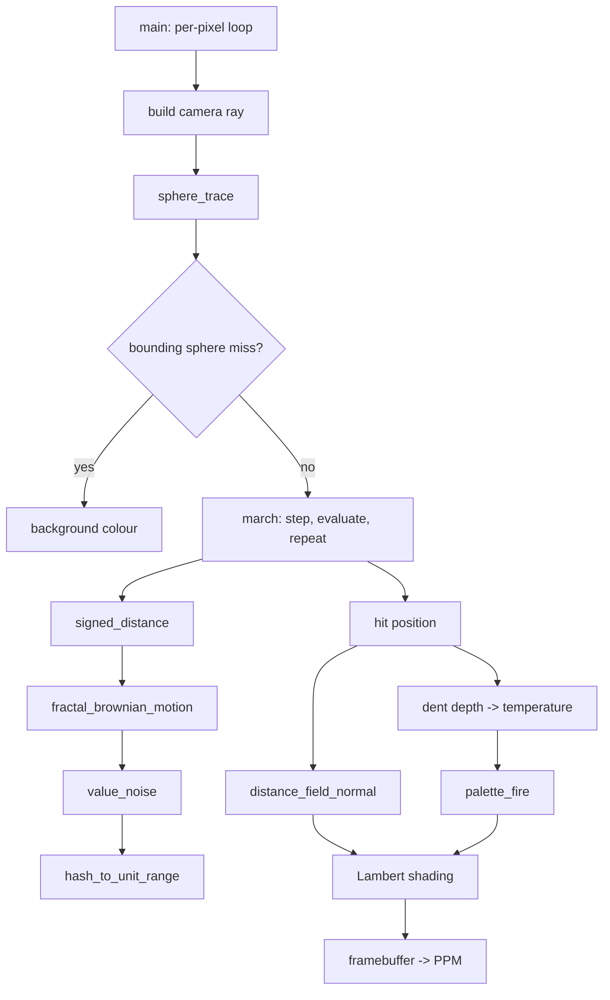

![[res/raymarcher.png]]

**640×480. One sphere, one light, no triangles, no mesh, no acceleration structure.** The entire scene is a single mathematical function that answers one question "*how far am I from the surface?" and the renderer walks along each ray asking it repeatedly until the answer goes negative. ~180 lines of logic, C++20, no dependencies, output is a `.ppm` file.

This is my version of [ssloy's tinykaboom](https://github.com/ssloy/tinykaboom). Let me be precise about what "my version" means, because the honest description is more interesting than the flattering one.

**The algorithm is his. The understanding is mine.** I did not invent a noise function or a shading model. What I did was take 180 lines of extremely terse code and refuse to move a single line of it across until I could explain exactly what that line computed and why. That turned out to be much harder than writing it from scratch would have been, and it surfaced three things the original doesn't mention:
- **[[#Part 3 The line that would not compile|A line of the original computes something entirely different from what it looks like.]]** It's written in the universal shape of a component-wise smooth step. It is actually a dot product. My own vector library refused to compile it, which is how I found out.
- **[[#Part 4 Sixty percent of the noise is a clamp|~60% of the noise function's interpolation weights are out of range and get clamped.]]** I measured it. Large parts of every lattice cell collapse to a single corner value, and *that* is the mechanism behind the chunky, cauliflower look of the smoke. The artifact is load-bearing for the aesthetic.
- **[[#Part 5 The sine that has to be a double|The hash function silently depends on which `sin` overload your compiler picks.]]** Float precision gives you ~383 distinct random values. Double gives you ~200 billion. Same source code, visibly different image, and nothing warns you.

If you only read one section, read [[#Part 4 Sixty percent of the noise is a clamp|Part 4]].

---
## Why port something instead of writing something

The honest reason: my [[Building a CPU Raytracer from Scratch in C++20|previous project]] was a raytracer built from lesson notes with a strict no-copy-paste rule, and it taught me a lot about deriving math. It taught me nothing about **reading code I didn't write**, which is the thing I will actually spend most of my time doing in any real job.

So I set a different rule this time.
1. **Nothing moves across until I can explain it.** Not "it renders correctly", explain it, out loud, to nobody, in a comment.
2. **Reproduce the output bit-for-bit first, improve second.** If my image differs from the reference, I have a misunderstanding, not an improvement. Every deviation gets diagnosed, not papered over.
3. **Write every formula in unevaluated form.** `1.0f / 16.0f`, never `0.0625f`. `pi / 3.0f`, never `1.047f`. A constant that has been arithmetically simplified has had its reasoning deleted.
4. **Every non-obvious constant gets a comment explaining where it came from,** or it gets replaced with something I can justify.

Rule 2 is the one that did the work. Twice I "fixed" something that looked wrong, got a different image, and discovered that the original behaviour was load-bearing. Both times the interesting thing was *why*.

The result is a file you can read top to bottom. It is deliberately not optimized, and it says so.

---
## Architecture



| File | Responsibility |
|---|---|
| `vec.hpp` | Templated N-dimensional vector math (carried over from the raytracer, unchanged) |
| `main.cpp` | Hash, value noise, fBm, fire palette, the SDF, sphere tracing, shading, render loop, PPM writer |

Two files. The whole scene description is **one function of eleven lines**.

---
## Part 1: The whole scene is one function

A traditional Raytracer stores a list of objects and asks each one "does this ray hit you?" Ray marching stores nothing. It has a single function that takes a point in space and returns a **signed distance**:

$$
\text{sd}(\vec p) < 0 \;\Rightarrow\; \text{inside},\qquad
\text{sd}(\vec p) = 0 \;\Rightarrow\; \text{on the surface},\qquad
\text{sd}(\vec p) > 0 \;\Rightarrow\; \text{outside}
$$

For a sphere of radius $R$ centred at the origin that's just $\text{sd}(\vec p) = |\vec p| - R$. The trick that turns a sphere into an explosion is to make the radius **vary from point to point**:

$$
\text{sd}(\vec p) = |\vec p| - \big(R + \text{displacement}(\vec p)\big), \qquad
\text{displacement}(\vec p) = -\,\text{fbm}(3.4\,\vec p)\cdot A
$$

```cpp
float signed_distance(const Vec3f &point)
{
    const float noise_frequency = 3.4f;   // how many noise cells fit per world unit

    const float displacement  = -fractal_brownian_motion(point * noise_frequency) * noise_amplitude;
    const float local_radius  = sphere_radius + displacement;

    return length(point) - local_radius;
}
```

That is the entire model. There is no geometry anywhere in this program, no vertices, no triangles, no bounding volume hierarchy. The explosion exists only as the set of points where this expression happens to equal zero.

**The invariant hiding in the minus sign.** `fbm()` returns values in $[0, 1]$, and the displacement negates it. So displacement is **always ≤ 0**: the noise can only ever carve *into* the sphere, never bulge out of it. Everything the renderer will ever draw fits inside the original sphere of radius 1.5.

That is not a stylistic choice. It is the precondition that makes the early-out in [[#Part 7 Sphere tracing and the 10% step|Part 7]] correct. Flip that sign to get bulges instead of dents and the renderer will silently clip its own geometry, with no error and no crash, just a slightly wrong image. **The tracer's correctness depends on a property of the noise function two call levels away, and nothing in the code says so.** I wrote it down in a comment because a comment is the only enforcement mechanism available here. A better design would make the bounding radius a value the SDF *returns* rather than something the tracer assumes.

---
## Part 2: The vector library, and why I reused it

`vec.hpp` came over from the raytracer untouched: a templated N-dimensional vector with C++20 concepts and union-based storage specialisations, so `Vec3f` gives you both `.x` and `data[i]`, and all the arithmetic is written once for every `N`.

Reusing it was mostly pragmatism. It became the most important decision in the project for a reason I did not anticipate, which is [[#Part 3 The line that would not compile|the next section]].

It also paid off immediately in one small place. `linear_interpolation` is written once, generically:

```cpp
template <typename T>
inline T linear_interpolation(const T &start_value, const T &end_value, const float weight)
{
    const float clamped_weight = std::clamp(weight, 0.0f, 1.0f);
    return start_value + (end_value - start_value) * clamped_weight;
}
```

and it serves both the **scalar** blending inside the noise function (`float`) and the **colour** blending in the fire palette (`Vec3f`), because `vec.hpp` provides vector + vector, vector - vector and vector × scalar. One function, two very different jobs, zero duplication. That clamp is going to matter enormously in Part 4.

**The cost of the design, stated fairly.** My `operator*` is declared as `vec<T,N> * T`, exact type, no conversions. That means `position_in_cell * 2` doesn't compile; it has to be `2.0f`. Template argument deduction won't cross `int` to `float`. It's stricter than the original's library and it caught real mixed-type sloppiness, but it also means every literal needs a suffix. If I were shipping this as a library I'd widen it to `template<Arithmetic U> operator*(vec<T,N>, U)` with an internal `static_cast<T>`, keep the ergonomics, keep the explicitness at the point that matters.

---
## Part 3: The line that would not compile

Here is the original line, verbatim, from `tinykaboom`:

```cpp
f = f * (f * (Vec3f(3.f, 3.f, 3.f) - f * 2.f));
```

If you have written any shader code you recognize this instantly. It is **smooth step**. The Hermite curve $t^2(3-2t)$ that every noise function uses to round off the interpolation weights so cells don't meet at visible creases. Everyone knows this line. Nobody reads it.

I pasted it in and it did not compile. Two errors, both on the same line, both from `vec.hpp`:

- `f * 2.f` = fine.
- `Vec3f - Vec3f` = fine.
- `f * (Vec3f)` = **no such operator.** My vector library has no `vec * vec`.

That is not a bug in my library. It is a deliberate omission: `vec * vec` is genuinely ambiguous. It could mean the dot product (returns a scalar) or the Hadamard component-wise product (returns a vector). Those are completely different operations, and I refused to pick one silently, so I provided neither and made `dot()` a named function.

So I went and read ssloy's `geometry.h` to find out which one he meant.

**It's the dot product.**

Which means that line does not compute what it looks like it computes. Expanded, the original is:

$$
\vec f \;\leftarrow\; \vec f \cdot \underbrace{\big\langle \vec f,\; \vec 3 - 2\vec f \big\rangle}_{\text{a single scalar}}
$$

The inner parenthesis collapses to **one number**, which then scales all three components uniformly. It is not the component-wise smoothstep

$$
f_i \leftarrow f_i^2\,(3 - 2 f_i)
$$

that the syntax is universally understood to mean. The three axes are no longer smoothed independently. They're all multiplied by the same shared scalar, so the interpolation weights stay perfectly proportional to each other. The smoothing is anisotropic, aligned along the cell diagonal.

This is a large part of why the original author describes his own noise as *"a bad noise function with lots of artifacts."* The artifacts have a specific cause, and this is it.

I reproduced the behaviour exactly, but I made it say what it does:

```cpp
const Vec3f three(3.0f, 3.0f, 3.0f);
const float smoothing = dot(position_in_cell, three - position_in_cell * 2.0f);
position_in_cell = position_in_cell * smoothing;
```

Same result, same image, but now the `float smoothing` declaration tells you the truth: a scalar came out of that expression. The intended component-wise version is in an appendix at the bottom of `main.cpp` for anyone who wants the nicer image.

**What I actually take from this.** An operator overload that resolves to something surprising doesn't produce an error, it produces a plausible wrong answer that survives code review forever, because reviewers pattern-match the shape of the expression rather than resolving the overloads. The only reason I caught it is that **my type system disagreed with the code and I went to find out why instead of making the error go away.** The reflex to just add a `vec * vec` overload and move on would have cost me the entire finding. Nobody would ever have known, least of all me.

---
## Part 4: Sixty percent of the noise is a clamp

Part 3 left me with a question I couldn't answer from reading alone: the "smoothstep" is now a scalar multiply, so what does that actually do to the interpolation weights?

Smoothstep's whole job is to map $[0,1] \to [0,1]$. This version doesn't. Let's bound it.

The smoothing scalar is $s = \sum_i f_i(3 - 2f_i)$ with each $f_i \in [0,1)$. Each term $f(3-2f)$ is a downward parabola peaking at $f = 0.75$, where it takes the value $1.125$. Three axes, so

$$s \in [0,\; 3.375]$$

and the new weight on each axis is $f_i \cdot s$, which can therefore reach **3.375**, more than three times outside the valid range for an interpolation weight.

So I stopped reasoning and measured it. 400,000 uniformly sampled points inside a cell:

| Quantity | Value |
|---|---|
| Mean smoothing scalar $s$ | **2.50** |
| Range of $s$ | 0.095 → 3.375 |
| Weights that clamp to 1.0 | **59.7%** |
| Weights strictly inside (0, 1) | 40.3% |

**Roughly six out of every ten interpolation weights in this noise function are out of range and get clamped.**

The only reason the renderer doesn't produce garbage is the `std::clamp` inside `linear_interpolation`. The innocuous defensive line from Part 2 is silently absorbing the overflow on the majority of calls. And a clamped weight means the lerp returns one endpoint exactly: **that region of the cell snaps to a single lattice corner value.** Instead of a smooth gradient across each cell, you get large flat plateaus with narrow transition bands between them.

That is precisely what the render looks like. Those chunky, cauliflower-textured blobs of smoke are not a stylistic choice or an artifact of the octave count. They are the geometry of a clamp. Fix the smoothstep and the explosion turns into something softer and, to my eye, considerably less interesting.

I left it as-is, and now it's a documented decision rather than an inherited accident.

**Why this section is the one I'd point a reviewer at.** Reading the code told me the line was a dot product. It did not tell me the consequence. The consequence needed an actual experiment (bound the expression analytically, then sample it to get the distribution) and it turned "this noise is bad" into "this noise is 60% nearest-neighbor lookup, and here's the number." That gap between *reading* code and *knowing what it does* is the entire reason I did this project.

---
## Part 5: The sine that has to be a double

The random number generator underneath everything is one line, and it's the oldest trick in graphics:

$$\text{hash}(n) = \text{frac}\big(\sin(n) \cdot 43758.5453\big)$$

`sin` is bounded to $[-1, 1]$, so multiplying by a huge constant and throwing away the integer part leaves you with digits that leap around wildly for tiny changes in the seed. It isn't random in any rigorous sense. It's deterministic, cheap, and looks random, which is all a noise function needs.

I wrote it in float, because everything else in the project is float. The noise came out visibly coarser than the reference, blockier, with an obvious stair-stepped quality. The algorithm was identical. The precision wasn't.

**Where the bits go.** $\log_2(43758.5453) \approx 15.42$, so that multiply shifts the value left by about **15.4 binary places**. The fractional part you keep afterwards is built entirely from the sine's *lowest* bits, the multiply pushes everything you'd normally consider "the answer" up past the binary point and off the top.

A `float` has a 24-bit significand. Burn 15.4 of them on the shift and there are ~8.6 bits left below the point:

| Precision | Significand | Effective step in the result | Distinct values |
|---|---|---|---|
| `float` | 24 bits | ~1/383 | **~383** |
| `double` | 53 bits | ~1/2×10¹¹ | **~2×10¹¹** |

A single-precision sine simply does not have enough bits left over to be scrambled. Your "random" values come quantized into a few hundred buckets, and since noise is *nothing but* a spatial arrangement of those values, the quantization shows up directly in the image.

The fix is to compute the sine in double and narrow afterwards:

```cpp
const float scrambled = static_cast<float>(std::sin(static_cast<double>(seed)) * huge_amplitude);
const float fractional_part = scrambled - std::floor(scrambled);
```

**The part that should worry you.** The original writes an unqualified `sin(n)` on a `float`. Which overload that resolves to (`float sin(float)` or `double sin(double)`) depends on your standard library headers and what else got pulled into the global namespace. It is not something you can determine by reading the function.

So there is a source file that renders one image on one toolchain and a visibly different image on another, with no warning, no `#ifdef`, and nothing in the code hinting that precision is load-bearing. That's a portability bug wearing a maths costume. The casts in my version are ugly on purpose: they're the only way to say *this needs 53 bits and I know why* in a form the compiler will actually honor.

---
## Part 6: Stacking octaves, and a matrix I checked

**Value noise** puts a pseudo-random number at every integer lattice point and blends the 8 corners of whichever cell your sample lands in. A corner needs to become a single number to feed the hash, which is done with three de-correlating strides:

$$\text{corner\_id}(i_x,i_y,i_z) = i_x \cdot 1 + i_y \cdot 57 + i_z \cdot 113$$

The strides are arbitrary. They just need to be large and unrelated enough that adjacent corners land far apart in the hash's domain.

One octave of that looks like static. **Fractal Brownian motion** makes it look like nature: sum several octaves, each at a higher frequency and a smaller amplitude.

$$\text{fbm}(\vec p) = \frac{\sum_k A_k \cdot \text{noise}(F_k \vec p)}{\sum_k A_k}, \qquad A_k = \tfrac12,\tfrac14,\tfrac18,\tfrac1{16}$$

Amplitudes halve each octave; the frequency gains are 2.32, 3.03 and 2.61, **deliberately non-integer**, so the lattices of different octaves never re-align and stack their corners on top of each other into a visible grid.

The division by $\sum A_k = 15/16$ is not cosmetic. It's what guarantees `fbm` lands in $[0,1]$, which is exactly the invariant that [[#Part 1 The whole scene is one function|Part 1]] depends on to keep the surface inside the bounding sphere. Drop the normalisation and you break the tracer, several functions away.

**The matrix.** Before any octaves are summed, the sample point goes through a fixed 3×3 matrix:

```cpp
const Vec3f row_0( 0.00f,  0.80f,  0.60f);
const Vec3f row_1(-0.80f,  0.36f, -0.48f);
const Vec3f row_2(-0.60f, -0.48f,  0.64f);
```

The original presents this as a magic constant. I wanted to know whether the specific numbers mattered, so I checked its properties:

$$M M^{\mathsf T} = I, \qquad \det M = +1$$

It's **orthonormal, with determinant exactly +1**, a proper rotation, not a reflection and not a scale. That's the whole point, and it's why these particular numbers were chosen rather than any three rows: a rotation reorients the sample space away from the coordinate axes (so the lattice-aligned noise stops looking lattice-aligned) **while preserving lengths**, meaning it changes the noise's orientation without touching its frequency. Any old matrix would have smeared the frequency content too.

Five minutes with the determinant turned "magic constant, copied faithfully" into "rotation matrix, here's why it has to be one." That's the difference between a comment that describes and a comment that justifies.

---
## Part 7: Sphere tracing and the 10% step

Marching a ray naively in fixed steps is both slow and wrong. Too big and you tunnel straight through thin features, too small and you spend forever crossing empty space. **Sphere tracing** uses the distance function itself as the step size: if the nearest surface is 2 units away, you can safely jump 2 units, because nothing can possibly be in between.

That's the textbook version. This code steps **10%** of the reported distance, and caps the march at 128 steps:

```cpp
const float step_length = std::max(distance_to_surface * step_safety_factor, minimum_step);
```

The reason is stated in the comment above `signed_distance` and it's the sort of thing that's obvious once you've been bitten: **this SDF is not a true distance field.** Full-distance stepping is only safe when the function is 1-Lipschitz, when it never *underestimates* how far you are from the surface. Subtracting a noise term whose gradient can exceed 1 breaks exactly that guarantee. The function confidently reports "2 units clear" when the real answer is less, you take the full step, and you land inside geometry you were supposed to hit, the surface just isn't there any more. Holes in the explosion, worse where the noise is steepest.

The 0.1 factor is the fudge that buys the safety margin back. It's not elegant, and the principled fix is to divide by the maximum gradient magnitude of the field, but 0.1 is honest about being conservative and 128 steps caps the cost.

`minimum_step = 0.01` handles the other failure mode. At grazing angles the distance shrinks faster than you advance and you converge geometrically without ever arriving, Zeno's paradox, but it eats your frame budget. The floor guarantees forward progress.

**The early-out.** Before marching at all, the tracer checks whether the ray misses the bounding sphere entirely, using Pythagoras rather than a square root:

$$d_{\text{closest}}^2 = |\vec o|^2 - (\vec o \cdot \hat d)^2$$

If that exceeds $R^2$, return immediately. On a 640×480 image where the explosion covers maybe a third of the frame, most rays die here for the cost of two dot products, and crucially, **before** the first of up to 128 noise evaluations, each of which is four octaves of eight hashes. This is the single highest-leverage line in the renderer, and it is only correct because of the sign invariant from Part 1.

---
## Part 8: Normals from nothing

There's no mesh, so there are no vertex normals. The normal of an implicit surface is the **normalised gradient of its distance function**, approximated with forward differences:

$$
\vec N \;\propto\; \Big(\text{sd}(\vec p + \epsilon \hat x) - \text{sd}(\vec p),\;\;
\text{sd}(\vec p + \epsilon \hat y) - \text{sd}(\vec p),\;\;
\text{sd}(\vec p + \epsilon \hat z) - \text{sd}(\vec p)\Big)
$$

The $1/\epsilon$ that belongs on each term is the *same* on all three, so it only scales the vector and vanishes when you normalise. Dropping it is free.

**`eps = 0.1` is enormous** (nearly 7% of the sphere's radius) and that is deliberate. Because the surface is made of noise, evaluating the gradient at a genuinely small $\epsilon$ samples the high-frequency octaves and the normals jitter wildly from pixel to pixel: a salt-and-pepper speckle across the whole surface, since Lambert shading turns any normal error straight into a brightness error.

A large $\epsilon$ **low-pass filters the normal.** You're measuring the slope of the surface averaged over a 0.1-unit window instead of at a point, so the fine noise averages out and you get the broad shape. Push it further and the surface flattens into a plain sphere.

So `eps` is not a numerical-accuracy parameter here. It's an **aesthetic control** (a blur radius on the lighting) and it's the main reason the render reads as billowing smoke rather than sandpaper. Worth naming as such rather than leaving it looking like a tolerance someone tuned until the speckle went away.

Two honest limitations: forward differences bias the normal by half a step in the $(1,1,1)$ direction (central differences would fix it at 6 SDF evaluations instead of 4), and `normalized()` on a zero gradient produces NaN with no guard. The second hasn't fired because the noise makes an exactly-zero gradient vanishingly unlikely (which is luck, not design).

---
## Part 9: Turning depth into fire

There's no combustion simulation here, and no temperature field. The colour comes from a geometric proxy: **how deep inside the original sphere the hit point landed.**

```cpp
const float dent_depth = (sphere_radius - length(hit_position)) / noise_amplitude;
```

A hit right on the unperturbed sphere surface means the noise barely dented it, that's an outer wisp, and it should be smoke. A hit deep inside means the noise carved a deep pit there, you're seeing into the core, and it should be white-hot. Dividing by the amplitude normalises it to roughly $[0,1]$.

Then two constants remap it:

```cpp
const float palette_offset = -0.2f;
const float palette_scale  =  2.0f;
const float fire_temperature = (dent_depth + palette_offset) * palette_scale;
```

Written out, $t = 2(d - 0.2)$, so $t = 0$ at $d = 0.2$ and $t = 1$ at $d = 0.7$. Everything shallower than 0.2 clamps to pure smoke; everything deeper than 0.7 clamps to pure yellow; the entire fire gradient is compressed into the middle band.

**These are not color choices, they're a contrast curve**. The levels slider, applied to depth. That's why the explosion has crisp fire against crisp smoke rather than a mushy gradient everywhere. Naming them `offset` and `scale` instead of leaving `(d - 0.2f) * 2.f` inline is a small thing that makes the knob discoverable.

The palette itself is five stops at even quarters: `gray → darkgray → red → orange → yellow`. Note that the *coldest* stop (0.4) is **lighter** than the second (0.2), the gradient brightens, darkens, and only then ignites, which is what gives the smoke that pale outer rim before it goes sooty.

**The hot end is over-bright on purpose:** yellow is `(1.7, 1.3, 1.0)`, well past 1.0 in two channels. It has to be, because it's about to be multiplied by a light intensity below 1. Storing it over-bright means the core survives shading and still clips to white, instead of coming out a dull mustard.

---
## Part 10: Getting pixels out

PPM (`P6`) is the simplest image format that exists: a short ASCII header, then raw RGB bytes. No library, no dependency.

**The undefined behaviour I avoided by luck and then understood on purpose.** Colours here routinely exceed 1.0 by design. Converting an out-of-range float directly to a `char` is UB, not "wraps around", not "clamps", but genuinely undefined, and in practice it produces garbage pixels that look like a rendering bug and send you hunting in completely the wrong file. So the clamp happens **on the integer, after the conversion**:

```cpp
const int channel_value = std::clamp(static_cast<int>(max_channel_value * color[channel]), 0, max_channel_value);
output_file.put(static_cast<char>(static_cast<unsigned char>(channel_value)));
```

The double cast through `unsigned char` is deliberate too, that's the one conversion whose behaviour is fully specified for the whole 0–255 range regardless of whether `char` is signed on your platform.

**A decision I made differently from last time.** In my raytracer I argued that clamping channels independently shifts the hue (an over-bright orange clamps toward yellow) and I normalised by the largest channel instead to preserve the ratios.

Here I clamp per channel, and I think that's correct *for this scene*. The hue shift climbs toward white, and a hot core blowing out to white is exactly what fire does in every photograph ever taken of it. Ratio-preserving tone mapping would keep the core orange and make it look less hot, not more accurate.

Same maths, opposite conclusion, because the subject changed. That felt worth writing down: the raytracer's rule wasn't wrong, it just wasn't universal, and I only noticed because I'd bothered to justify it the first time.

The file is opened with `std::ios::binary`, without which Windows helpfully translates every `0x0A` byte into `\r\n` and corrupts any pixel whose channel value happens to be 10.

---
## Part 11: The one performance thing

The render loop carries a single pragma:

```cpp
#pragma omp parallel for
```

Every pixel is independent, reads only shared constants, and writes to its own framebuffer index computed from its own coordinates. No synchronization, no false-sharing mitigation needed at this resolution, no atomics, the loop is embarrassingly parallel in the technical sense, and this is the rare case where one line is the entire optimization.

It's also **the item I listed as future work at the end of my last project**, now line one of this one. That was satisfying in a way that's slightly out of proportion to the effort involved.

Everything else is left slow on purpose. There is no SIMD, no hash memorization, no caching of the four `signed_distance` calls in the normal computation (three of which could reuse the fourth,  a free 25% off every shaded pixel). The stated goal is a file you can read top to bottom, and every one of those optimizations trades legibility for speed.

---
## Bugs, and how I found them

| Symptom                                  | Cause                                                                                                     | Fix                                                                                                                             |
| ---------------------------------------- | --------------------------------------------------------------------------------------------------------- | ------------------------------------------------------------------------------------------------------------------------------- |
| `f * (Vec3f - f*2)` refused to compile   | My `vec.hpp` deliberately has no `vec * vec`; the original's resolves to the **dot product**              | Wrote it as an explicit `dot()` returning a named `float smoothing` - [[#Part 3 The line that would not compile\|Part 3]]       |
| Noise visibly coarser than the reference | `sin` evaluated in float; the ×43758 multiply leaves only ~8.6 fractional bits, quantising to ~383 values | Force the sine to `double`, narrow after - [[#Part 5 The sine that has to be a double\|Part 5]]                                 |
| Blocky, plateaued cells in the noise     | ~60% of interpolation weights exceed 1.0 and clamp, snapping regions to a single corner value             | Diagnosed and **kept** — it's the source of the cauliflower texture - [[#Part 4 Sixty percent of the noise is a clamp\|Part 4]] |
| `position_in_cell * 2` wouldn't deduce   | `operator*` takes `T` exactly; `int` won't convert during template deduction                              | `2.0f`. Longer term, widen the operator to accept any `Arithmetic U`                                                            |
| Garbage pixels in the output file        | Casting an out-of-range float straight to `char` is UB, and colours here exceed 1.0 by design             | Clamp the **integer** after conversion, then go through `unsigned char`                                                         |
| Image upside down                        | Image space has +y down, world space has +y up                                                            | Negate y **inside** the ray-direction formula, where the convention flip actually happens                                       |

The last one is the same bug I hit in my Raytracer, and I fixed it in the same five seconds. That's the reward for having written the previous devlog: **convention bugs are a category, not an incident.** Upside-down images, inside-out normals, rays spawning on the wrong side of a surface, none of these are maths errors. They're disagreements about which way is up, and once you've named the category you stop debugging them one at a time.

The general method was the same too: **render the quantity, don't print it.** Suspect the normals? Write `(N + 1) * 0.5` into the framebuffer and look at the colors, a correct normal map has a recognizable shape and a wrong one is obvious at a glance. Suspect the noise? Render `fbm` straight to greyscale; the clamping plateaus from Part 4 are visible instantly that way, and completely invisible in a debugger. A 640×480 debug image tells you more in one second than a breakpoint hit 307,200 times.

---
## What I'd do next

Ordered the way I'd actually pick them up:
1. **Cache the center sample in `distance_field_normal`.** It calls `signed_distance` four times; three of them could share the fourth's result. Free 25% off every shaded pixel, no legibility cost. Genuinely just an oversight.
2. **Fix `normalized()` in `vec.hpp`.** It calls `length(v)` *inside* the loop, so normalizing a `Vec3f` does three square roots where one would do. I flagged this at the end of my last project and shipped it again here, which is a real lesson about the gap between "wrote it down" and "fixed it". Correct but wasteful code doesn't fail any test, so nothing ever forces the issue.
3. **Make the bounding radius part of the SDF's contract** rather than an invariant the tracer assumes. Return it, or make it a compile-time property, so flipping the displacement sign becomes a compile error rather than a silently clipped image.
4. **Reorder `normalized()` and `length()`** in the header. `normalized` is defined *above* `length` and calls it anyway; it compiles only because it's a dependent call resolved at instantiation via ADL. It works, but it relies on a two-phase-lookup subtlety no reader should need to know.
5. **Step size from the actual Lipschitz bound** instead of the 0.1 fudge, by dividing by the field's maximum gradient magnitude. Fewer wasted steps and a real safety guarantee instead of an empirical one.
6. **Central differences for the normal,** optionally, with `eps` exposed as the blur control it actually is.
7. **A `UnitVec3f` type.** Both `sphere_trace` and the early-out require a normalised direction and neither can enforce it. Same unwritten contract I identified in the raytracer and still haven't made the compiler check.
8. **Animate it.** The SDF takes a point; adding a time parameter and offsetting the noise sample along a fourth axis gives a churning explosion for very little code. This is the obvious next step and the one I actually want to do.

---
## What I took away

**Reading code is a separate skill from writing it, and it's the one that pays rent.** I could have written a ray marcher from scratch in an afternoon and learned less. Reproducing someone else's exactly forces you to account for every line, including the ones that don't do what they appear to do, and in a real codebase, those are the only ones that matter.

**When the type system disagrees with you, it might be right.** The single most valuable finding in this project came from a compile error I could have made disappear in ten seconds by adding an overload. The strictness I'd built into `vec.hpp` for the *previous* project turned out to be a detection mechanism for a semantic bug in *this* one, purely because it refused to guess what I meant.

**"Faithful reproduction" and "understanding" are the same discipline.** Every time my output differed from the reference, the difference was a misunderstanding I could name and then explain. Chasing bit-exactness sounds pedantic; it's actually the most reliable bug-finder I've used, because it converts vague unease into a specific pixel that is specifically wrong.

**Measure the thing you're guessing about.** "This noise has artifacts" is a shrug. "59.7% of the interpolation weights clamp" is a diagnosis, and it took twenty lines of throwaway Python. The distance between those two sentences is the distance between describing a system and understanding it.

**Some bugs are load-bearing.** The clamping in Part 4 is what makes the smoke look like smoke. If I'd "fixed" it on sight I'd have shipped a worse image and a shorter devlog. Knowing *why* something is wrong is what earns you the right to decide whether to change it.

---
## Build

```bash
g++ -std=c++20 -O2 main.cpp -o raymarcher
./raymarcher              # writes out.ppm

# with the render loop parallelised
g++ -std=c++20 -O2 -fopenmp main.cpp -o raymarcher

magick out.ppm render.png
```

No dependencies beyond the standard library. Resolution, FOV, camera, light and background are at the top of `main()`; `sphere_radius` and `noise_amplitude` at the top of the file control how big the explosion is and how deeply the noise dents it.

---
_Reference material: [ssloy/tinykaboom](https://github.com/ssloy/tinykaboom), "KABOOM! in 180 lines of bare C++". The algorithm is his, unchanged. This is a line-by-line reconstruction with every formula left in unevaluated form and every non-obvious step explained, plus three things about it I don't think are documented anywhere else._
